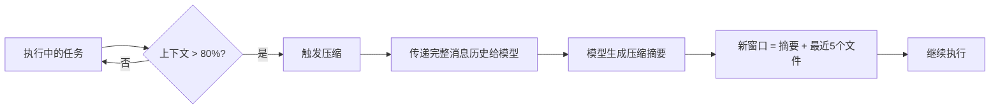
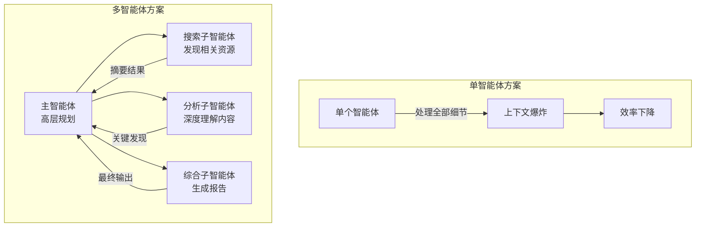
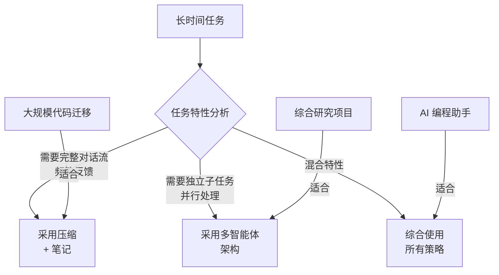

## 10.8 长时间任务的上下文策略

### 10.8.1 长时间任务的核心挑战

长时间任务（Long-Horizon Tasks）指那些需要数十分钟乃至数小时才能完成的复杂工作，如大规模代码库迁移、综合研究项目分析、全书内容处理等。这类任务面临的核心挑战是：**如何在有限的上下文窗口内保持任务的连贯性、上下文的完整性和行为的目标一致性**。

即使模型具备超大上下文窗口（如 1M Token），长时间任务仍然需要专门的上下文管理技术，因为：

1. **信息污染不可避免**：随着任务推进，中间结果、失败尝试、工具输出等都会在上下文中积累，逐渐淹没关键信息
2. **成本约束**：超大上下文的单次调用成本很高，不能无限扩展
3. **延迟约束**：上下文越大，首 Token 延迟越高，影响用户体验

### 10.8.2 策略一：压缩（Compaction）

**定义**：在上下文接近限制时，将对话历史压缩为高保真摘要，然后在新的上下文窗口中继续执行。

**核心流程**：



**压缩策略的设计原则**：

关键是**选择性保留**（Selective Retention）——某些信息必须完整保留，某些可以丢弃：

| 信息类型 | 处理方式 | 理由 |
|---------|---------|------|
| **保留** | | |
| 架构决策 | 完整保留 | 影响后续所有实现 |
| 未解决的 Bug | 完整保留 | 防止重复踩坑 |
| 当前计划 | 摘要保留 | 指导后续步骤 |
| **丢弃** | | |
| 工具执行成功的输出 | 仅保留摘要 | 已完成的步骤不需要全部细节 |
| 冗余的中间结果 | 完全丢弃 | 清理重复和过期信息 |
| 调试日志 | 仅保留关键错误 | 保留教训，丢弃噪声 |

**实现示例**（Claude Code 的做法）：

```text
原始消息历史（100K tokens）：
- 消息 1-50：代码编写、测试、迭代细节（冗长）
- 消息 51-100：最终的成功执行

压缩提示词：
"""
请总结以下编程任务的进度。保留：
1. 整体的架构设计决策
2. 任何未解决的 Bug 或技术债
3. 已完成功能的简要清单
4. 当前的下一步计划

请忽略：
1. 详细的日志输出
2. 成功的测试结果（只说"测试通过"）
3. 逐行代码diff（保留最终版本即可）
"""

压缩后的摘要（5K tokens）：
✓ 核心架构：使用异步事件循环 + 消息队列
✗ 待解决：性能优化（当前吞吐量 1000 req/s，目标 5000）
✓ 已完成：数据模型、API 端点、基础认证
→ 下一步：性能测试、负载均衡实现
```

**压缩的艺术**：

最具挑战性的是“**回忆优化**”（Recall Optimization）——在压缩时不遗漏关键信息。建议的方法：

1. **先最大化回忆**：初期的压缩提示词应该尽可能包含细节
2. **后迭代精简**：在多次压缩的测试中，逐步移除冗余内容
3. **针对性微调**：针对你的特定任务，找到最佳的信息保留平衡

### 10.8.3 策略二：结构化笔记（Structured Note-Taking）

**定义**：智能体在执行过程中定期将重要信息写入持久化的外部记忆，然后在上下文重置时重新读取。

**与压缩的区别**：
- **压缩**：被动的、自动的，由系统在上下文满时触发
- **笔记**：主动的、有意识的，由智能体主动记录关键信息

**笔记结构设计**：

一个良好的笔记体系包含多个文件，各自承载不同的信息层级：

```text
project/
├── NOTES.md          # 日记式的工作日志
├── PROGRESS.md       # 最新的进度跟踪
├── ARCHITECTURE.md   # 架构和关键决策
├── KNOWN_ISSUES.md   # 已知问题和解决方案
└── NEXT_STEPS.md     # 下一步计划
```

**NOTES.md 示例**（类似开发日志）：

```markdown
# 项目日志

## 2026-03-28 第 3 天

### 上午（推理步骤 1-50）
- 实现了用户认证模块
- 发现数据库连接池有内存泄漏
  * 症状：连续 100 个请求后内存占用翻倍
  * 临时方案：每 50 个请求重启一次连接池
  * 待根本解决

### 下午（推理步骤 51-100）
- 完成 API 路由设计
- 添加了日志记录中间件
- 性能测试：单机 500 RPS（待优化至 5000）

### 关键发现
- 选择 FastAPI 而非 Django 的决定是正确的（更轻量）
- 需要在架构中加入缓存层

### 当前状态
- 代码行数：8500+
- 测试覆盖率：65%（目标 85%）
- 预计完成日期：2026-04-05
```

**Pokemon 游戏案例**（Anthropic 的真实例子）：

这是一个展示笔记在长时间任务中威力的著名案例。Claude 通过自动化方式玩 Pokemon 游戏数小时，使用笔记追踪：

```markdown
# Pokemon 训练日志

## 当前目标
将皮卡丘从等级 5 训练至等级 15（目标突破）

## 进度跟踪
- 当前位置：一号路线（第 1234 步）
- 皮卡丘等级：5 → 7（+2）
- 经验值进度：1234/1500（达到目标还需 266 步）
- 上次升级时间：23:45

## 战斗记录（最近 5 场）
- 野生小鸟 (等级 3)：赢，获得 150 XP
- 野生小鸟 (等级 4)：赢，获得 180 XP
- 野生毛毛虫 (等级 3)：赢，获得 140 XP
- 训练师对战（5 只 Pokémon）：赢，获得 500 XP
- 野生小拉达 (等级 5)：赢，获得 200 XP

## 已学技能
- 电击：威力 40，成功率高
- 绷紧：辅助技能，提高防御
- 充电：蓄力技能

## 待办事项
- 学习新技能（闪电）需要 Lv. 13
- 收集 TM28（地震）增加多样性
- 探索新路线寻找更强对手

## 战略决策
避免强敌（等级 8+），专注经验值积累
```

**笔记的自动化管理**：

智能体在每个重要的里程碑（如完成一个大任务、遇到错误、上下文即将满）时自动更新笔记：

```python
def on_major_milestone(state, action_result):
    # 更新笔记文件
    if is_success(action_result):
        append_to_progress_md({
            "timestamp": now(),
            "milestone": action_result.description,
            "state": summarize_current_state(state)
        })
    elif is_error(action_result):
        append_to_known_issues_md({
            "error": action_result.error,
            "attempted_solution": action_result.solution,
            "workaround": generate_workaround(action_result)
        })

    # 当上下文接近满时，也触发更新
    if context_usage() > 0.75:
        update_summary_in_notes(state)
```

### 10.8.4 策略三：多智能体架构（Sub-Agent Architecture）

**定义**：不让单个智能体承载整个长时间任务，而是分解为多个专用的子智能体，每个子智能体有独立的上下文窗口，最后由主智能体综合结果。

**架构对比**：



**关键优势**：

1. **上下文隔离**：每个子智能体的处理细节不污染主智能体的上下文
2. **并行执行**：多个子智能体可以同时工作，加快总体进度
3. **专业化**：子智能体可以针对特定任务优化提示词和工具

**多智能体研究系统案例**（Anthropic 的例子）：

在一个需要深度调研的任务中，使用以下架构：

```text
Lead Agent（主智能体）
├── 角色：研究主导、规划、综合
├── 工作流：
│   1. 分析用户问题
│   2. 分解为子任务，委派给各子智能体
│   3. 接收结果摘要
│   4. 综合生成最终报告
└── 上下文占用：低（只处理摘要）

├─ Search Sub-Agent（搜索子智能体）
│  ├── 角色：网络搜索、信息发现
│  ├── 工作：搜索 20+ 个网站，返回 5 个最相关的
│  ├── 输出：一份 2KB 的摘要
│  └── 上下文占用：自内部消化大量搜索结果
│
├─ Reading Sub-Agent（阅读子智能体）
│  ├── 角色：深度阅读、信息提取
│  ├── 工作：读取长文档，提取相关段落
│  ├── 输出：3 段精选文本 + 要点
│  └── 上下文占用：自处理长文档分析
│
└─ Synthesis Sub-Agent（综合子智能体）
   ├── 角色：整合信息、撰写报告
   ├── 工作：基于主智能体提供的摘要生成结构化报告
   ├── 输出：最终报告（1-2K 字）
   └── 上下文占用：相对较小
```

**效果对比**（示意性数据）：

| 维度 | 单智能体 | 多智能体 |
|------|---------|---------|
| 处理 10 个数据源 | 上下文 150K | 上下文 30K（主） + 各子智能体隔离 |
| 处理时间 | 串行，较长 | 并行，显著缩短 |
| 结果质量 | 可能遗漏细节 | 更全面，专业化处理 |
| 系统复杂度 | 低 | 中等 |

### 10.8.5 策略选择指南

选择合适的策略取决于任务特性：



**具体建议**：

1. **代码开发任务**（如 Claude Code）：
   - 优先使用：压缩 + 笔记（保留架构决策和 Bug 记录）
   - 辅助使用：多智能体（代码审查、测试子智能体）

2. **研究和分析任务**：
   - 优先使用：多智能体（搜索、分析、综合的分工）
   - 辅助使用：压缩（处理超长子任务）

3. **复杂交互任务**（如客服、个人助手）：
   - 优先使用：笔记（用户历史、偏好、当前状态）
   - 辅助使用：压缩（超长对话历史）

4. **混合场景**（现实大多数生产任务）：
   - 综合使用所有三个策略
   - 根据实际运行情况微调配置

### 10.8.6 最佳实践

1. **早期规划**：在任务开始前预设压缩、笔记和多智能体的策略

2. **监控指标**：跟踪上下文使用率、压缩频率、任务完成时间

3. **迭代改进**：根据实际运行数据调整策略参数

4. **测试验证**：在 pre-production 环境测试长时间任务的稳定性

5. **用户反馈**：收集真实任务中的反馈，优化笔记结构和压缩策略

### 10.8.7 策略四：跨会话持久记忆

前面三种策略（压缩、笔记、多智能体）解决的是 **单次长任务内** 的上下文管理。但在真实产品场景中，还有一种更长时间尺度的挑战：**跨会话的状态延续**。

用户今天的对话结束后，明天再回来时，系统需要“记住”之前的上下文——不只是对话记录，而是用户的偏好、项目状态、已做的决策和待解决的问题。

#### 跨会话记忆的独特挑战

跨会话记忆比单次任务内的上下文管理更难，因为：

1. **时间跨度不确定**：两次会话之间可能间隔几分钟，也可能间隔几周。间隔期间，用户的状态可能已经变化
2. **外部状态漂移**：用户可能在其他工具中做了变更（更新了代码、修改了文档、回复了邮件），这些变更不在对话历史中
3. **事实冲突积累**：随着会话次数增加，历史记录中的矛盾信息会逐渐增多

#### 从对话存储到状态维护

新一代记忆框架（如 Supermemory）的核心思路是：不把整段对话塞进存储，而是将记忆重新定义为 **持续状态维护**。具体做法包括：

- **事实抽取**：从每次对话中自动提取结构化事实，而非存储原始文本
- **画像分层**：将用户状态拆分为“静态画像”（长期稳定的偏好和背景）和“动态画像”（近期上下文和临时状态），分别管理
- **冲突消解**：当新事实与旧事实矛盾时，自动执行覆盖，而非让两者共存
- **多源同步**：通过连接器实时同步外部系统（文档、代码仓库、邮件），补充对话之外的状态变化

#### 与压缩和笔记的关系

跨会话记忆与前述策略是 **不同时间尺度上的互补**：

| 策略 | 时间尺度 | 核心问题 |
|------|---------|---------|
| 压缩（10.8.2） | 单次对话内（分钟级） | 上下文窗口溢出 |
| 笔记（10.8.3） | 单次任务内（小时级） | 任务进度延续 |
| 多智能体（10.8.4） | 单次任务内（并行） | 信息量超载 |
| **跨会话记忆** | 跨任务（天/周级） | 用户状态延续与演化 |

在实践中，这四种策略往往需要组合使用：单次会话内用压缩和笔记保持连贯，会话间用持久记忆维护状态，复杂任务用多智能体分解负载。

### 来源标注

本节内容融合了 Anthropic 在 Claude Code 和多智能体研究系统中的实践经验，参考资料：
- "Effective context engineering for AI agents" (Anthropic, 2025-09-29)
- Claude Code 中的压缩和笔记机制
- "How we built our multi-agent research system" (Anthropic)
