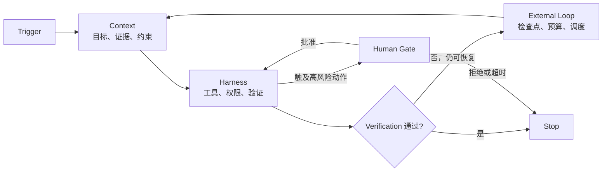

## 10.9 Context→Harness→External Loop

长任务可靠性不只取决于模型能记住多少内容。更实用的系统边界是三层：`Context` 提供本轮判断所需的证据，`Harness` 约束本轮可以采取的动作，`External Loop` 决定何时再次运行以及何时停止。三层共同执行同一份控制契约，才能在多轮、跨会话和外部状态变化下保持目标一致。

### 10.9.1 三层职责

| 层 | 核心职责 | 典型输入 | 必须输出 |
| --- | --- | --- | --- |
| Context | 选择与当前决策有关的目标、证据、约束和历史结果 | 用户目标、当前产物、来源、上轮摘要 | 带来源和新鲜度的最小充分上下文 |
| Harness | 提供工具、权限边界、验证器和可观察执行环境 | 控制契约、工具定义、沙箱、测试 | 动作结果、验证证据、结构化错误 |
| External Loop | 在模型调用之外保存状态、调度重试、处理超时与升级 | 检查点、触发器、预算、停止条件 | 下一轮任务或终止状态 |

`Context` 不是完整历史，`Harness` 也不只是工具列表。前者要能解释本轮为何这样判断，后者要用执行边界防止模型把不确定判断直接变成高风险副作用。`External Loop` 则把时间、重试和状态恢复从一次模型调用中剥离出来。



图 10-9：Context、Harness 与 External Loop 共享控制契约

### 10.9.2 用控制契约贯穿三层

控制契约沿用第 10.8 节的六个字段：`Trigger`、`Goal`、`Verification`、`Stop`、`Memory`、`Human Gate`。各层只解释自己负责的部分，不得生成互相矛盾的副本。

```yaml
trigger: issue-approved
goal: 修复指定缺陷并生成可复现产物
verification:
  - 单元测试通过
  - 产物校验通过
stop:
  success: 所有验证通过
  failure: 同一根因连续失败两次
memory:
  persist: [current_scope, decisions, failures, next_action]
  exclude: [secrets, raw_credentials]
human_gate:
  required_for: [push, release, delete, production_write]
```

字段的所有者应明确：外部系统产生 `Trigger`；用户或任务负责人批准 `Goal` 与 `Human Gate`；项目验证器定义 `Verification`；调度器执行 `Stop` 与预算；检查点存储实现 `Memory`。模型可以建议修改，但不能单方面扩大这些边界。

### 10.9.3 Harness 的默认拒绝边界

可靠的 Harness 先区分读取和写入，再按最小权限开放动作：

1. 读取工具默认只访问任务范围内的来源，并返回来源、时间和错误，而不是把空结果伪装成成功。
2. 写入工具默认拒绝范围外路径、符号链接逃逸和未经批准的外部副作用。
3. 测试、格式检查、渲染和产物校验是独立验证器；模型的自述不能替代这些证据。
4. 推送、发布、删除、生产写入、外发消息和权限扩大必须进入人类门控。
5. 工具失败要保留退出状态和最小必要上下文，供 External Loop 判断是重试、换路径还是停止。

这里的默认拒绝不是让系统停滞，而是让每次能力扩大都有明确依据。只读探索可以自动推进；高风险写操作在批准前保持不可执行。

### 10.9.4 External Loop 的状态机

External Loop 至少维护五种状态：`ready`、`running`、`waiting_for_human`、`blocked`、`completed`。每一轮结束时只允许一个明确的下一状态：

| 当前结果 | 下一状态 | 处理方式 |
| --- | --- | --- |
| 验证通过且 Goal 完成 | `completed` | 写入最终证据，停止调度 |
| 可恢复失败且预算充足 | `ready` | 记录根因、缩小下一步，不重复无效动作 |
| 需要 Human Gate | `waiting_for_human` | 固化检查点，不先执行后补确认 |
| 不可恢复失败或达到 Stop 条件 | `blocked` | 报告阻塞证据和所需的新决定 |
| 外部状态变化使上下文过期 | `ready` | 丢弃过期结论，重新选择 Context |

重试次数不是可靠性的替代品。下一轮必须基于新增证据或不同假设；如果输入、动作和预期都没有变化，重复调用只会放大成本与副作用风险。

### 10.9.5 Memory 的最小检查点

可恢复检查点应保存：控制契约版本、已完成范围、当前产物哈希、验证结果、失败根因、未完成项和下一步。它不应保存 secret，也不应把未经验证的推测升级成事实。

恢复时按以下顺序重建：

1. 重新验证 `Trigger` 是否仍成立；
2. 比较外部产物与检查点哈希，识别并发变化；
3. 加载未完成范围和最近一次失败证据；
4. 重新运行便宜的前置验证；
5. 只有在控制契约仍有效时才进入 Harness。

这样，`Memory` 保存的是可继续工作的状态，不是对话的无限复制。

### 10.9.6 评审清单

- Context 是否只含当前决策所需信息，并标明来源、新鲜度和冲突？
- Harness 是否分离读写能力、默认拒绝越界路径，并把验证器放在模型之外？
- External Loop 是否有显式预算、停止条件、幂等重试与唯一下一状态？
- 控制契约六字段是否完整，且恢复、压缩、委派后仍保持一致？
- 人类门控是否发生在副作用之前，并能在拒绝或超时后安全停止？
- 最终交付是否包含真实验证证据，而不是只包含完成声明？

三层设计的目标不是让模型自主运行得更久，而是让系统在每一轮都知道：为什么继续、允许做什么、凭什么完成，以及何时必须停下来交给人。
