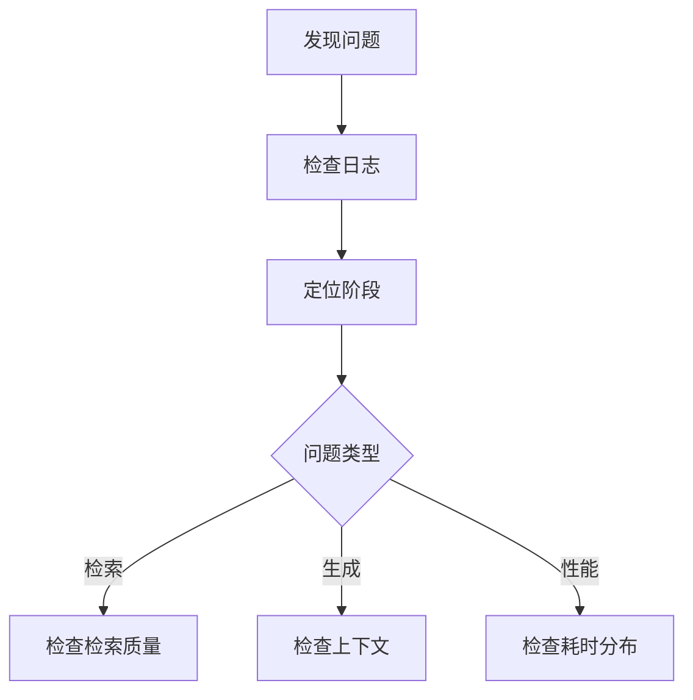

## 10.3 可观测性与调试

### 可观测性的三大支柱

**日志（Logs）**
记录系统运行的详细事件

**指标（Metrics）**
量化的系统状态数据

**追踪（Traces）**
请求在系统中的完整路径

### 上下文相关的关键指标

| 指标 | 说明 | 告警阈值 |
|------|------|----------|
| 上下文 Token 数 | 每次请求的上下文大小 | 接近窗口上限 |
| 检索延迟 | 检索操作耗时 | > 500ms |
| 检索命中率 | 检索到相关结果的比例 | < 80% |
| 压缩率 | 压缩后/压缩前 | 异常波动 |
| 成本/请求 | 单次请求的成本 | 超出预算 |

### 日志设计

#### 结构化日志

```json
{
  "timestamp": "2024-03-01T10:00:00Z",
  "request_id": "req_123",
  "stage": "context_build",
  "input_tokens": 500,
  "retrieved_chunks": 5,
  "context_tokens": 2000,
  "duration_ms": 150
}
```

#### 日志级别

- **ERROR**：失败的操作
- **WARN**：接近限制、降级处理
- **INFO**：关键流程节点
- **DEBUG**：详细调试信息

### 请求追踪

完整追踪请求处理流程：

```
request_123
├── 接收请求 [0ms]
├── 查询处理 [10ms]
├── 知识检索 [120ms]
│   ├── 嵌入计算 [30ms]
│   └── 向量搜索 [90ms]
├── 重排序 [50ms]
├── 上下文构建 [20ms]
├── 模型调用 [800ms]
└── 响应返回 [1000ms]
```

### 上下文快照

保存关键请求的完整上下文：

```python
if should_snapshot(request):
    save_snapshot({
        "request_id": request.id,
        "full_context": context,
        "retrieved_docs": docs,
        "model_response": response,
        "metadata": {...}
    })
```

用于：调试问题、效果分析、回放测试

### 调试技巧

#### 问题定位流程



#### 常见问题诊断

| 症状 | 可能原因 | 检查点 |
|------|----------|--------|
| 答案不相关 | 检索问题 | 检索结果、嵌入质量 |
| 答案不完整 | 上下文不足 | 上下文内容、压缩程度 |
| 幻觉 | 缺乏依据 | 是否有相关知识 |
| 响应慢 | 瓶颈 | 各阶段耗时 |

### 监控仪表盘

建立可视化监控：
- 实时请求量和延迟
- Token 使用分布
- 错误率趋势
- 成本累计

### 告警设置

配置关键告警：
- 错误率超过阈值
- 延迟异常升高
- 成本超出预算
- Token 接近上限
