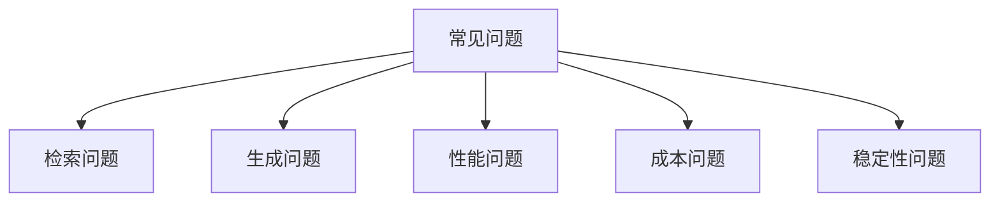

## 10.5 常见问题与解决方案

在上下文工程的实践中，会遇到各种问题。本节汇总常见问题的诊断方法和解决方案，帮助快速定位和解决问题。

### 问题分类

上下文工程中的问题可以分为以下几类：



### 检索问题

检索是 RAG 系统的核心环节，检索问题直接影响最终效果。

#### 问题：检索不到相关内容

**症状**：用户提问后，系统返回"未找到相关信息"或答案明显缺乏依据。

**可能原因**：
- 知识库未包含相关信息
- 嵌入模型与查询类型不匹配
- 分块策略导致信息碎片化
- 检索阈值设置过高

**诊断步骤**：
1. 检查知识库是否包含相关文档
2. 手动测试查询的嵌入相似度
3. 查看检索返回的原始结果（含得分）
4. 对比不同分块大小的检索效果

**解决方案**：
1. 补充知识库覆盖度：添加缺失的文档
2. 测试嵌入模型效果：尝试不同的嵌入模型
3. 调整分块参数：增大块大小或添加重叠
4. 引入混合检索：结合关键词和语义检索
5. 降低检索阈值：获取更多候选结果

#### 问题：检索结果不相关

**症状**：检索返回了内容，但与用户问题不相关。

**可能原因**：
- 语义相似但实际不相关（如同一领域的不同话题）
- 关键词权重不足
- 缺少重排序步骤

**诊断步骤**：
1. 查看检索返回的具体内容
2. 分析查询与结果的语义关系
3. 检查是否存在关键词匹配

**解决方案**：
1. 添加重排序步骤：使用交叉编码器二次排序
2. 结合关键词检索：对专有名词等使用精确匹配
3. 优化查询改写：使用 HyDE 等技术增强查询
4. 添加元数据过滤：按类别、时间等过滤

### 生成问题

即使检索正确，生成阶段仍可能出现问题。

#### 问题：答案不准确

**症状**：模型的回答与事实不符，或与检索内容矛盾。

**可能原因**：
- 上下文信息不足
- 模型产生幻觉
- 指令不够明确
- 检索内容质量差

**诊断步骤**：
1. 检查上下文是否包含正确答案
2. 对比模型输出与上下文内容
3. 分析系统提示词的约束是否清晰

**解决方案**：
1. 补充更多相关信息：增加检索数量
2. 强化约束指令：明确要求"仅基于上下文回答"
3. 加入事实核查步骤：让模型自查答案依据
4. 使用引用格式：要求模型标注信息来源

```python
# 在系统提示词中加入约束
system_prompt = """
基于提供的上下文回答问题。
如果上下文中没有相关信息，请明确说明"根据现有信息无法回答"。
每个关键论点都需要引用上下文中的具体内容。
"""
```

#### 问题：不遵循指令

**症状**：模型不遵守输出格式要求，或忽略重要约束。

**可能原因**：
- 指令被淹没在大量上下文中
- 格式要求不清晰
- 上下文存在冲突信息

**诊断步骤**：
1. 检查指令在上下文中的位置
2. 验证指令表述是否明确
3. 检查是否有相互矛盾的内容

**解决方案**：
1. 使用 XML 标签隔离：`<instructions>...</instructions>`
2. 重要指令放在开头/结尾：利用位置优势
3. 简化和明确指令：避免模糊表述
4. 移除冲突内容：确保上下文一致

#### 问题：输出不一致

**症状**：相同问题多次询问得到明显不同的答案。

**可能原因**：
- 温度（temperature）设置过高
- 上下文每次略有变化
- 检索结果不稳定

**解决方案**：
1. 降低温度参数：设为 0 或很低的值（如 0.1）
2. 固定上下文模板：确保每次构建一致
3. 使用更明确的格式约束：减少输出变异
4. 固定随机种子：部分模型支持

### 性能问题

#### 问题：响应延迟高

**症状**：用户等待时间过长，影响体验。

**可能原因**：
- 上下文过长
- 检索慢
- 网络延迟
- 模型响应慢

**诊断步骤**：
1. 分解各阶段耗时（检索、构建、生成）
2. 检查上下文 Token 数量
3. 监控网络延迟

**解决方案**：
1. 压缩上下文：减少 Token 数量
2. 优化索引：使用更高效的向量索引
3. 使用缓存：缓存常见查询结果
4. 流式输出：改善用户感知延迟
5. 模型降级：延迟敏感时使用更快模型

#### 问题：吞吐量不足

**症状**：高并发时请求堆积，响应变慢。

**解决方案**：
1. 并行处理：充分利用异步能力
2. 批量请求：合并处理相似请求
3. 横向扩展：增加服务实例
4. 队列缓冲：使用消息队列削峰

### 成本问题

#### 问题：成本超出预算

**症状**：API 费用快速增长，超出预期。

**诊断步骤**：
1. 分析 Token 使用分布
2. 识别高成本的请求类型
3. 检查是否有异常请求

**解决方案**：
1. 压缩上下文减少 Token
2. 使用更小的模型处理简单任务
3. 增加缓存命中率
4. 设置成本限制和告警
5. 清理滥用或无效请求

### 稳定性问题

#### 问题：服务不稳定

**症状**：偶发性失败、超时或异常。

**解决方案**：
1. 实现重试机制：指数退避重试
2. 设置超时控制：防止无限等待
3. 添加熔断器：故障时快速失败
4. 准备降级方案：核心功能保证可用

```python
@retry(max_attempts=3, backoff=exponential)
@timeout(30)
@circuit_breaker(failure_threshold=5)
async def call_llm(prompt):
    return await model.generate(prompt)
```

### 问题诊断清单

遇到问题时，按此清单逐项检查：

- [ ] 上下文内容是否正确构建？
- [ ] Token 数量是否在限制内？
- [ ] 检索是否返回相关结果？
- [ ] 重排序是否正常工作？
- [ ] 指令是否清晰且被遵循？
- [ ] 是否有错误日志？
- [ ] 性能指标是否正常？
- [ ] 最近是否有配置变更？

### 问题上报模板

团队协作时，使用标准化的问题报告格式：

```markdown
## 问题描述
[具体症状]

## 复现步骤
1. [步骤1]
2. [步骤2]

## 相关日志
[关键日志片段]

## 已尝试的解决方案
- [方案1]: [效果]

## 环境信息
- 模型版本：
- 配置版本：
- 发生时间：
```

通过系统化的问题诊断和解决流程，可以快速定位问题根因，减少排查时间，提高系统可靠性。
