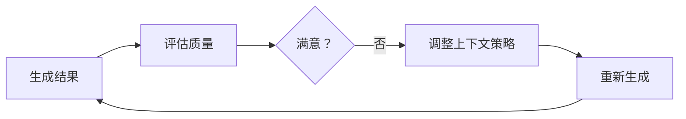

## 11.3 自适应与智能上下文管理

### 静态 vs 自适应

传统上下文管理使用固定策略，而**自适应上下文管理**根据具体情况动态调整。未来的方向是让模型"参与"到上下文的选择中来。

### 自适应策略

#### 自适应检索 (Adaptive Retrieval)

根据查询复杂度调整检索强度：

```python
def adaptive_retrieve(query):
    complexity = assess_complexity(query)
    # 简单问题直接回答，复杂问题多跳检索
    if complexity == "high":
        return multi_step_agentic_retrieve(query)
    return simple_vector_search(query)
```

#### 任务感知型重排 (Task-Aware Reordering)

不同任务对上下文顺序的偏好不同。Transformer 模型对开头和结尾的内容关注度更高（Primacy/Recency Effect）。

- **代码调试任务**：错误日志置顶 > 相关代码 > 环境信息
- **法律分析任务**：法规条文置顶 > 案件事实 > 历史判例

可以通过分类器判断任务类型，动态调整 prompt 模板中的各部分顺序。

#### 注意力预测注入 (Attention-Based Injection)

这是一种前沿的自适应架构：利用轻量级模型预测主模型对候选上下文的**注意力热图**。

1. **候选池**：准备大量候选上下文片段。
2. **预测**：小模型预测主模型在回答当前问题时会"关注"哪些片段。
3. **注入**：只将高关注度的片段注入上下文。

这种方法实现了上下文的按需供给，最大化利用窗口的有效信息密度。

#### 智能压缩 (ICAE)

**上下文自动编码器 (In-Context Autoencoder, ICAE)** 是一种新兴技术。它训练模型将长文本压缩为短的"软提示词"（Soft Prompts）或潜在向量，而非人类可读的摘要。

- **编码**：将 4000 token 的文本压缩为 100 个特殊的 token。
- **解码**：LLM 能够理解这些压缩 token 并基于此回答问题。
- **优势**：压缩率极高，且保留了原始上下文的语义特征。

### 实现机制

#### 反馈循环

基于结果反馈调整策略：



#### 学习优化

从历史数据中学习最优策略：
- 记录不同策略的效果
- 分析成功和失败案例
- 自动优化参数

### 实施要点

1. **定义评估指标**：如何判断效果好坏

2. **设置调整范围**：避免过度调整

3. **保持可解释**：理解为什么做出调整

4. **监控效果**：验证自适应是否有效
