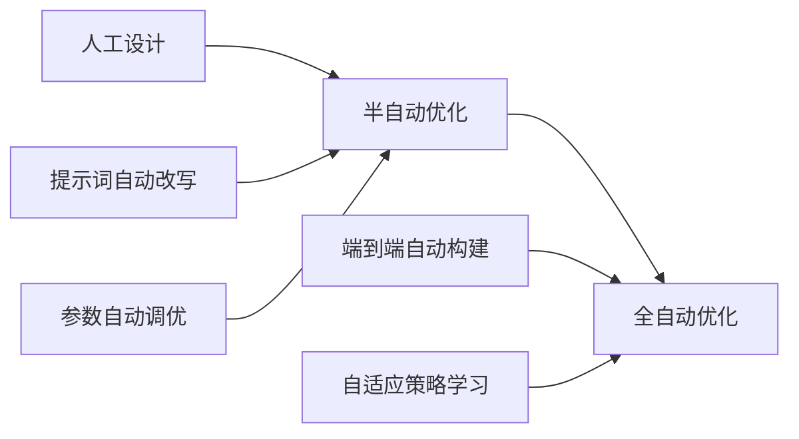

## 12.3 挑战与机遇

上下文工程作为一个快速发展的领域，面临着诸多挑战，同时也蕴含着巨大的机遇。理解这些挑战和机遇，有助于把握行业发展方向。

### 当前挑战

#### 技术挑战

**评估困难**

如何客观评估上下文质量仍是一个开放性难题：

| 挑战 | 具体表现 | 当前应对 |
|------|----------|----------|
| 缺乏统一标准 | 不同任务的评估指标不统一 | 建立任务特定的评估体系 |
| 间接评估的局限 | 上下文质量只能通过下游效果间接评估 | 结合多维度指标综合判断 |
| 评估成本高 | 人工评估耗时，自动评估不够准确 | LLM 辅助评估 + 人工抽检 |
| 主观性强 | "好的上下文"定义因场景而异 | 建立场景化的评估基准 |

**动态优化**

如何在运行时动态调整上下文策略：
- 实时决策的复杂性：需要快速判断最优策略
- 效果预测的不确定性：无法准确预测调整效果
- 成本与效果的平衡：优化本身也有代价
- 探索与利用的权衡：尝试新策略 vs 使用已知有效策略

**可解释性**

理解上下文如何影响模型输出：
- 归因问题：无法精确知道输出受哪部分上下文影响
- 调试复杂度：问题定位困难
- 透明度要求：某些场景（如医疗、法律）需要解释决策依据
- 可追溯性：需要追踪答案来源

**跨模态上下文**

随着多模态模型的发展：
- 如何统一管理文本、图像、音频、视频上下文
- 不同模态的有效表示和检索
- 跨模态的相关性判断

#### 工程挑战

**复杂性管理**

大规模系统的上下文管理复杂度高：
- 多组件协调：检索、压缩、缓存等模块的协作
- 版本和配置管理：提示词、策略、参数的版本控制
- 测试覆盖：难以覆盖所有边界情况
- 故障排查：分布式系统的问题定位

**成本控制**

在效果和成本间找到平衡：
- Token 成本持续增长：随着使用量增加
- 计算资源管理：嵌入计算、向量检索的资源需求
- ROI 量化：难以精确量化上下文优化的投入产出

**规模化**

从 PoC 到大规模生产的鸿沟：
- 性能在高并发下的退化
- 知识库规模增长带来的检索性能问题
- 多租户架构的复杂性

#### 组织挑战

**专业人才稀缺**

上下文工程人才相对稀缺：
- 跨领域技能要求：需要同时理解 LLM、检索、工程
- 经验积累需要时间：实践经验尤为重要
- 培训体系不完善：缺乏系统化的培养路径
- 快速变化的技术：持续学习压力大

**组织协作**

跨团队协作的复杂性：
- AI 团队与业务团队的沟通
- 知识库维护的责任归属
- 效果评估标准的对齐

### 未来机遇

#### 技术机遇

**自动化优化**

AI 辅助的上下文工程自动化：

具体方向：
- 自动提示词优化：DSPy 等框架的发展
- 智能分块策略：根据内容自动选择
- 自适应检索：根据查询动态调整策略
- 上下文自动编码：ICAE 等压缩技术

**标准化红利**

标准化带来的效率提升：
- 可复用组件：标准化的模块可跨项目复用
- 更好的工具支持：标准化促进工具生态发展
- 知识共享：最佳实践的传播和复用
- 互操作性：不同系统间的集成更容易

**模型能力提升**

模型能力持续增强带来的机遇：
- 更长的上下文窗口：信息管理方式的变革
- 更好的指令遵循：上下文设计更简单
- 多模态能力：统一的跨模态上下文管理
- 推理能力增强：更复杂的上下文利用

#### 商业机遇

**差异化竞争力**

上下文工程能力成为核心竞争优势：
- 更好的用户体验：通过记忆和个性化
- 更高的准确性：通过精准的知识检索
- 更低的成本：通过优化的上下文策略
- 更快的迭代：通过系统化的评估和优化

**新产品形态**

基于上下文工程的创新产品：
- 具有真正记忆的个人助手
- 领域专家级别的 AI 系统
- 智能协作工作平台
- 知识管理和增强系统

**服务化机会**

上下文工程服务的市场空间：
- 知识库构建和维护服务
- 上下文系统咨询和优化
- 评估和监控平台
- 行业解决方案

#### 职业机遇

上下文工程师将成为重要的新兴职业：

| 机遇维度 | 具体表现 |
|----------|----------|
| 需求增长 | 企业 AI 应用的普及推动需求 |
| 跨行业适用 | 各行业都需要上下文工程能力 |
| 高价值定位 | 影响 AI 应用的核心效果 |
| 发展空间 | 从工程师到架构师到 AI 技术负责人 |

### 应对策略

面对挑战，把握机遇的建议：

1. **投资技术深度**：深入理解原理，而非只停留在工具使用层面
2. **关注评估能力**：建立系统化的评估体系
3. **保持学习敏锐**：紧跟领域发展，拥抱新技术
4. **积累领域知识**：结合具体行业场景积累经验
5. **构建可复用能力**：形成自己的方法论和工具库
