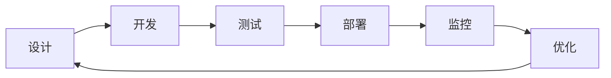

## 10.1 上下文工程工作流

### 10.1.1 开发到生产的流程

上下文工程项目需要遵循系统化的工作流程，从最初的设计阶段到最终的持续优化，形成完整的闭环。



### 10.1.2 设计阶段

设计阶段决定了整个项目的基础架构和技术选型，需要充分调研和规划。

**需求分析**

深入理解业务需求是设计的基础：
- 明确任务类型和复杂度：问答、生成、推理还是复合任务
- 评估上下文需求量：预估典型场景需要多少知识和历史
- 确定性能和成本约束：延迟要求、预算上限、并发规模
- 识别用户特征：技术水平、使用频率、期望体验

**架构设计**

基于需求确定技术方案：
- 选择适合的模型：综合考虑能力、成本、延迟和部署方式
- 设计上下文结构：确定系统层、知识层、任务层、交互层的内容
- 规划检索和记忆方案：选择 [RAG](../05_select/5.1_rag_principles.md) 策略、向量数据库、缓存机制
- 定义工具和能力边界：确定需要集成的工具和 API

**文档化**

完善的文档是团队协作和后续维护的基础：
- 记录设计决策及其理由
- 定义接口规范和数据格式
- 创建示例和测试用例
- 编写部署和运维指南

### 10.1.3 开发阶段

开发阶段需要遵循模块化和可测试的原则，便于后续迭代和维护。

**模块化实现**

将系统分解为独立可测试的模块：
- 上下文构建器：负责组装最终提示词的核心模块
- 检索模块：实现知识检索和相关性排序
- 压缩模块：处理上下文压缩和摘要
- 结果处理器：格式化输出和后处理

**配置外置**

将可能变化的部分外置为配置：
- 提示词模板可配置：支持不修改代码即可调整提示词
- 参数可调整：检索数量、压缩阈值等参数化
- 策略可替换：支持插件式更换检索或压缩策略

**版本管理**

对关键资产进行版本控制：
- 提示词版本控制：每次修改都有记录和回滚能力
- 配置版本追踪：配置变更与代码版本关联
- 变更历史记录：谁在什么时间做了什么修改

### 10.1.4 测试阶段

测试是保证质量的关键环节，需要建立多层次的测试体系。

**单元测试**

针对各个模块的独立测试：

```python
def test_context_builder():
    context = builder.build(input_data)
    assert count_tokens(context) < MAX_TOKENS
    assert contains_required_sections(context)
    
def test_retrieval_quality():
    results = retriever.search("测试查询")
    assert len(results) > 0
    assert results[0].score > MIN_RELEVANCE_THRESHOLD
```

**集成测试**

验证模块间的协作：
- 端到端流程测试：从用户输入到最终输出的完整流程
- 边界情况验证：超长输入、空输入、特殊字符等
- 性能基准测试：响应时间、吞吐量、资源使用

**评估测试**

衡量实际效果：
- 质量评估：按 3.3 节方法评估上下文质量
- 与基线对比：与优化前或竞品对比效果
- 回归测试：确保新改动不影响已有功能

**自动化测试流水线**

建立 CI/CD 集成的自动化测试：


### 10.1.5 部署阶段

部署需要谨慎进行，确保平滑过渡和快速回滚能力。

**渐进式发布**

采用灰度发布策略：
- 先小流量验证：1%-5% 流量观察效果
- 逐步扩大范围：确认无问题后扩展到 20%、50%、100%
- 保留快速回滚能力：一键回退到上一版本
- A/B 测试支持：同时运行多个版本对比效果

**配置管理**

生产环境的配置需要严格管理：
- 环境分离：开发、测试、预发布、生产环境配置隔离
- 敏感信息保护：API Key 等敏感信息使用密钥管理服务
- 配置热更新：支持不重启服务即可更新配置

### 10.1.6 监控与优化

上线后需要持续监控和优化，形成改进闭环。

**实时监控**

关键指标的实时监控：
- Token 使用量：输入输出 Token 的分布和趋势
- 响应延迟：P50、P95、P99 延迟指标
- 错误率：各类错误的发生频率和类型

**定期分析**

周期性的深度分析：
- 效果趋势：用户满意度、任务成功率的变化
- 成本分析：各模块的成本占比和优化空间
- 用户反馈：收集和分析用户反馈信号

**持续优化**

基于数据驱动的持续改进：
- 识别问题：通过监控和分析发现瓶颈
- 实验改进：A/B 测试验证优化方案
- 部署验证：确认改进效果后推广

### 10.1.7 协作与责任

上下文工程项目通常涉及多个角色的协作：

| 角色 | 职责 | 关键交付 |
|------|------|----------|
| AI 工程师 | 系统设计、核心开发 | 架构文档、核心代码 |
| 提示词工程师 | 提示词设计、评估 | 提示词模板、评估报告 |
| 数据工程师 | 知识库、数据流 | 数据管道、知识库 |
| SRE/运维 | 部署、监控 | 监控仪表盘、运维手册 |
| 产品经理 | 需求、评估标准 | PRD、验收标准 |

建立清晰的协作机制：
- 定期同步会议：对齐进度和问题
- 文档共享：使用统一的文档平台
- 变更评审：重要变更需要跨角色评审
