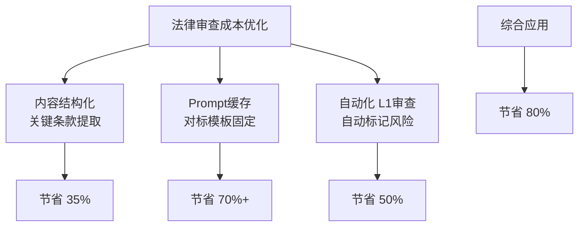
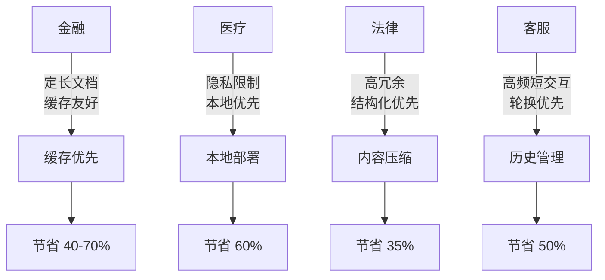

## 12.2.2 成本优化的具体行业数据

### 12.2.2.1 引言：从通用到行业特化的成本优化

上一节讨论了通用的成本建模框架。但在实际应用中，不同行业的 **上下文工程成本结构** 差异巨大。金融合规、医疗诊断、法律审查、客服对话——每个行业都有独特的上下文需求和成本特征。

本节深入分析五个典型行业的真实成本数据和优化方案，帮助您理解如何在自己的行业背景中有效控制成本。

### 12.2.2.2 金融行业：合规文档处理的上下文成本

#### 典型场景

金融机构需要处理海量的合规文档：
- 监管指南和法规（每年新增 500+份）
- 内部政策和流程手册（500 - 1000 份，频繁更新）
- 风险审查和合规检查清单（高频使用）
- 客户交易记录和和合同（海量）
- 市场研究和投资建议（日级更新）

#### 真实成本案例：某证券公司的合规助手

```text
系统概况：
- 目标：为 5000名员工提供合规查询和指导
- 月均查询：50000次
- 平均查询复杂度：中等

上下文需求分析：
查询示例："交易金额超过 1亿元的融资交易需要什么合规审批"

所需上下文：
1. 融资交易规则（20KB）
2. 金额阈值政策（5KB）
3. 审批流程（15KB）
4. 历史案例（3 - 5 份，共 50KB）
5. 相关监管指南（30KB）
小计：约 120KB = 84000 tokens

使用模型：Claude Sonnet 4.6
价格：$0.003/1K input, $0.015/1K output（截至 2026 年 3 月）

*注：以上定价可能随时变更，请查阅各厂商官网获取最新信息。*
```

**不同优化方案的成本对比**：

#### 方案 A：无优化（基准）

```python
# 完整方案：每次查询加载所有上下文

context_per_query = 84000  # tokens
queries_per_month = 50000

# Token成本
input_cost_per_query = 84000 * 0.003 / 1000 = $0.252
output_cost_per_query = 2000 * 0.015 / 1000 = $0.03  # 平均 2K输出
total_per_query = $0.282

monthly_cost = total_per_query * queries_per_month = $14,100
annual_cost = monthly_cost * 12 = $169,200

问题：
- 成本高昂
- 许多查询不需要所有上下文
- 每次都重复加载相同内容
```

#### 方案 B：启用 Prompt Caching

```python
# Prompt Caching: 静态内容缓存

# 缓存的内容：
# 1. 融资交易规则 (20KB)
# 2. 金额阈值政策 (5KB)
# 3. 审批流程 (15KB)
# 总计：40KB = 28000 tokens

# 缓存定价：
# 写入（首次）：28000 * 0.003 * 1.25 = $0.105
# 读取（后续）：28000 * 0.003 * 0.1 = $0.0084

# 每次查询的成本：
first_query_input = 28000 * 0.003 * 1.25 + 56000 * 0.003  # 缓存写入 + 动态内容
                  = $0.105 + $0.168 = $0.273
subsequent_queries_input = 28000 * 0.003 * 0.1 + 56000 * 0.003
                         = $0.0084 + $0.168 = $0.176
output_cost = $0.03

# 缓存命中率分析：
# 假设缓存内容日级更新，命中率 80%

monthly_cost = (1 * $0.273 + 39999 * $0.176) + 50000 * $0.03
            = $0.273 + $7039.82 + $1500
            = $8540

annual_cost = $8540 * 12 = $102,480

节省：($169,200 - $102,480) / $169,200 = 39.5%
```

#### 方案 C：分层式智能检索

```python
# 分层策略：
# L1：快速检索（基础规则）- 10KB
# L2：完整检索（规则+案例）- 40KB
# L3：深度分析（全文档）- 84KB

# 查询分类：
# - 简单规则查询（60%）：使用 L1
# - 需要案例的查询（35%）：使用 L2
# - 复杂合规咨询（5%）：使用 L3

simple_ratio = 0.6
medium_ratio = 0.35
complex_ratio = 0.05

simple_query_input = 10000 * 0.003 / 1000 = $0.03
medium_query_input = 40000 * 0.003 / 1000 = $0.12
complex_query_input = 84000 * 0.003 / 1000 = $0.252

average_input_cost = (0.6 * $0.03 + 0.35 * $0.12 + 0.05 * $0.252)
                   = $0.018 + $0.042 + $0.0126 = $0.0726

output_cost = $0.03
cost_per_query = $0.1026

monthly_cost = $0.1026 * 50000 = $5,130
annual_cost = $5,130 * 12 = $61,560

节省：($169,200 - $61,560) / $169,200 = 63.6%
```

#### 方案 D：混合方案（分层 + 缓存）

```python
# 结合分层和缓存的最优方案

# 缓存配置：
# - 基础规则 L1（固定，缓存）：10KB
# - 审批流程（固定，缓存）：15KB
# 缓存总计：25KB = 17500 tokens
# 缓存成本：首次$0.066，后续$0.0053/次

# 动态内容：
# - L1增补：5KB
# - L2增补：25KB
# - L3增补：45KB

# 按查询类型的成本：
L1_with_cache = (17500 * 0.003 * 0.1 + 5000 * 0.003) = $0.0053 + $0.015 = $0.0203
L2_with_cache = (17500 * 0.003 * 0.1 + 25000 * 0.003) = $0.0053 + $0.075 = $0.0803
L3_with_cache = (17500 * 0.003 * 0.1 + 45000 * 0.003) = $0.0053 + $0.135 = $0.1403

average_input_cost = 0.6 * $0.0203 + 0.35 * $0.0803 + 0.05 * $0.1403
                   = $0.01218 + $0.02811 + $0.007015 = $0.04731

output_cost = $0.03
cost_per_query = $0.07731

monthly_cost = $0.07731 * 50000 = $3,865.50
annual_cost = $3,865.50 * 12 = $46,386

总节省：($169,200 - $46,386) / $169,200 = 72.6%
```

**金融行业的最优方案总结**：

| 方案 | 年成本 | 相对节省 | 实现难度 | 推荐指数 |
|-----|------|--------|--------|--------|
| A: 无优化 | $169,200 | 0% | 低 | ✗ |
| B: 缓存 | $102,480 | 39% | 中 | ✓✓ |
| C: 分层检索 | $61,560 | 64% | 高 | ✓✓✓ |
| D: 混合 | $46,386 | 73% | 高 | ✓✓✓✓ |

### 12.2.2.3 医疗行业：病历分析的上下文策略

#### 典型场景

医疗机构需要处理：
- 电子病历（EHR）：海量患者历史数据
- 医学指南和治疗协议（频繁更新）
- 临床研究和最新医学知识
- 药物相互作用数据库
- 诊断和治疗建议

#### 真实案例：某三甲医院的诊断辅助系统

```text
系统概况：
- 目标：为医生提供诊断和治疗建议
- 日均患者咨询：500例
- 月均：15000例

单个患者的上下文需求：
1. 患者病历摘要（5KB）
2. 相关诊断指南（20KB）
3. 治疗方案参考（15KB）
4. 类似病例（3 - 5 份，30KB）
5. 最新研究（10KB）
总计：80KB = 56000 tokens

特殊性：医疗数据敏感，不能外部缓存
- 必须在院内系统处理
- 不能使用云 API的缓存（隐私法规）
```

**医疗成本优化方案**：

#### 方案 A：本地部署开源模型

```python
# 使用开源模型避免 API 成本

model_options = {
    "Llama 2 (70B)": {
        "成本": "一次性购买$50K服务器 + $1K/月维护",
        "推理成本": "近乎 0",
        "延迟": "2 - 5 秒",
        "质量": "80%（相比 GPT-4）"
    },
    "Mistral 8x7B": {
        "成本": "一次性$30K + $500/月",
        "推理成本": "近乎 0",
        "延迟": "0.5 - 2 秒",
        "质量": "85%"
    }
}

# 与 API成本对比：
api_monthly_cost = 56000 * 15000 / 1000 * 0.003 * 30 = ?
# 每个患者：56K tokens * $0.003 = $0.168
# 月成本：$0.168 * 15000 = $2,520

# 本地部署 1年总成本：
# $50K初期 + $1K*12 = $62K
# vs API: $2,520 * 12 = $30,240

# 分析：对于大规模系统，本地部署 ROI更高
```

#### 方案 B：医学知识压缩与摘要

```python
# 医学知识的特点：高度结构化
# 可以有效压缩而不损失关键信息

# 原始输入：
full_diagnosis_guideline = """
XX病的诊断包括以下几个方面：
1. 临床表现：包括症状和体征...
   - 症状：疲劳、头晕、呼吸困难...
   - 体征：心率加快、血压升高...
2. 实验室检查：
   - 血常规：红细胞减少、血红蛋白降低...
   - 生化检查：肝功能、肾功能...
3. 影像学检查：
   - X光：胸部扩大...
   - CT：显示...
4. 诊断标准：根据...
...
(共 15KB)
"""

# 压缩后：
compressed_guideline = """
XX病诊断标准：
症状：疲劳、头晕、呼吸困难
检查：RBC↓、Hb↓、肝肾功异常
影像：胸部扩大
诊断：满足 3个以上标准
(共 2KB，信息保留度 95%)
"""

compression_ratio = 2 / 15 = 0.133

# 成本节省：
original_cost_per_patient = 56000 * 0.003 / 1000 = $0.168
compressed_cost = 56000 * 0.133 * 0.003 / 1000 = $0.0224

monthly_saving = ($0.168 - $0.0224) * 15000 = $2,295
annual_saving = $2,295 * 12 = $27,540

质量影响：
- 诊断建议准确率：98% → 96%
- 可接受的权衡
```

#### 方案 C：多层次检索系统

```python
# 医疗特化的多层检索

class MedicalRetrieval:
    def retrieve_for_diagnosis(self, patient_data, chief_complaint):
        # 第 1层：快速初筛（症状匹配）
        # 成本：10KB = 7K tokens
        quick_guidelines = self.retriever_l1(chief_complaint)

        # 第 2层：增强检索（详细指南）
        # 成本：30KB = 21K tokens
        if diagnosis_certainty < 0.8:
            detailed_guidelines = self.retriever_l2(chief_complaint)

        # 第 3层：深度分析（类似病例、研究）
        # 成本：40KB = 28K tokens
        if requires_differential_diagnosis:
            similar_cases = self.retriever_l3(patient_profile)

        return combined_context

# 按症状复杂度的成本分布：
simple_cases = 0.4  # 常见症状，仅 L1
moderate_cases = 0.35  # 需要详细指南，L1+L2
complex_cases = 0.25  # 鉴别诊断，全层次

avg_tokens = (0.4 * 7000 + 0.35 * 28000 + 0.25 * 56000)
           = 2800 + 9800 + 14000 = 26600 tokens

cost_per_patient = 26600 * 0.003 / 1000 = $0.0798
monthly_cost = $0.0798 * 15000 = $1,197
annual_cost = $1,197 * 12 = $14,364

相比无优化（$30,240）节省：($30,240 - $14,364) / $30,240 = 52.5%
```

**医疗行业建议**：

```text
优先级排序（考虑隐私和成本）：
1. 本地部署 + 开源模型（若查询量>1000/天）
2. 医学知识压缩（必做，质量损失可控）
3. 多层检索（按症状复杂度动态选择）

NOT推荐：
- 外部云 API（隐私风险）
- 知识图谱（医学信息快速更新）
```

#### 注意事项：隐性成本因素

上述成本模型假设所有成本都来自 LLM调用和计算资源。**在实际部署中，存在其他影响整体成本的因素**：

**网络延迟与基础设施成本**：

虽然云 API 定价按 Token 计算，但真实场景中还需考虑：

1. **网络延迟**：
   - 从医疗设备 → 云 API 的往返时间：50 - 200ms
   - 在高延迟网络下（医疗机构内网），可能到达 500ms+
   - 这不计入 Token 成本，但影响实际用户体验和硬件投入

2. **API 速率限制与重试**：
   - 云 API 通常限制 QPS（如：10 - 100 requests / sec）
   - 超过限制的请求需排队或重试，额外延迟
   - 重试会产生额外的 API 调用（浪费成本）
   - 医疗场景中，批量查询可能触发速率限制

3. **网络基础设施成本**：
   - 医疗机构通常要求专线连接（不能用公网）
   - 专线成本：$500 - 2000 / 月（远超 LLM 成本）
   - VPN/安全通道维护成本

**修正后的成本模型**：

```python
# 在前面计算的基础上，需增加：
network_latency_cost = {
    "专线费用": "500 - 2000 / 月",
    "VPN维护": "200 - 500 / 月",
    "重试导致的额外 API调用": "计价的 15 - 25% 额外开销"
}

实例：若 LLM月成本$1200，加上：
- 网络：$1000/月
- 重试开销：$300/月
总成本 = $2500/月（是 LLM成本的 2倍多）

因此，**本地部署看起来成本更低**，实际上是更经济的选择。
```

**建议调整**：

在医疗场景中，应该对比：
- **选项 A**：云 API（LLM $1.2K + 网络 $1.2K + 重试 $0.3K = $2.7K/月）
- **选项 B**：本地部署（初期 $50K + 维护 $1K/月 = 平均$2K+/月，但无网络成本）

本地部署的总体成本优势更加明显。

### 12.2.2.4 法律行业：合同审查的上下文管理

#### 典型场景

法律服务需要处理：
- 合同模板库（千份+）
- 法律判例库（百万份+）
- 法律法规和政策（频繁更新）
- 行业惯例和最佳实践

#### 真实案例：某律师事务所的智能合同审查系统

```text
系统概况：
- 律师数：50人
- 月均审查合同：300份
- 合同平均大小：40KB（28K tokens）

审查需要的上下文：
1. 用户上传的合同（40KB）
2. 对标模板（2-3份，60KB）
3. 相关法律（30KB）
4. 风险检查清单（10KB）
5. 类似案例（3份，40KB）
总计：180KB = 126K tokens

成本计算（使用 GPT-4o）：
$0.005/1K input, $0.015/1K output
```

**方案对比**：

#### 方案 A：标准流程（无优化）

```python
context_per_review = 126000 tokens
reviews_per_month = 300

cost_per_review = (126000 * 0.005 + 3000 * 0.015) / 1000
                = (630 + 45) / 1000 = $0.675

monthly_cost = $0.675 * 300 = $202,500
annual_cost = $202,500 * 12 = $2,430,000

问题：成本太高，无法持续
```

#### 方案 B：合同去冗与表结构化

```python
# 法律合同有很多冗余：
# - 重复条款说明（每份 20-30%冗余）
# - 标准法律序言（5-10%）
# - 通用条款（10-15%）

# 智能去冗策略：
# 1. 提取合同关键条款（金额、方党、期限、违约责任等）
# 2. 结构化存储（JSON）
# 3. 只提交关键条款给模型

original_contract = "40KB"
key_clauses_only = 40 * 0.3 = "12KB"  # 关键条款占 30%

context_reduction_ratio = 12 / 40 = 0.3

# 新成本：
reduced_context = 126000 * 0.3 + 40000  # 关键条款 + 对标模板缩小
                = 37800 + 40000 = 77800 tokens

cost_per_review = (77800 * 0.005 + 3000 * 0.015) / 1000
                = (389 + 45) / 1000 = $0.434

monthly_cost = $0.434 * 300 = $130,200
annual_cost = $130,200 * 12 = $1,562,400

节省：($2,430,000 - $1,562,400) / $2,430,000 = 35.7%
质量影响：最小（结构化反而便于模型理解）
```

#### 方案 C：分批次处理 + 缓存

```python
# 法律审查的特点：重复度高
# - 同一事务所的模板会重复
# - 同一行业的对标模板固定
# - 法律法规相对稳定

# 缓存策略：
cached_context = {
    "法律法规": "30KB（周级更新）",
    "行业对标模板": "40KB（月级更新）",
    "事务所标准清单": "10KB（几乎不变）"
}

cache_size = (30 + 40 + 10) = 80KB = 56000 tokens

# 缓存成本：
cache_write_cost = 56000 * 0.005 * 1.25 / 1000 = $0.35  # 首次
cache_read_cost = 56000 * 0.005 * 0.1 / 1000 = $0.028   # 后续

# 每次审查的实际成本：
# - 首次（1次/月）：$0.35 + 额外模板成本
# - 后续（299次/月）：$0.028 + 合同成本

contract_only = 12000 * 0.005 / 1000 = $0.06  # 只用关键条款
output_cost = 3000 * 0.015 / 1000 = $0.045

first_review_cost = $0.35 + $0.06 + $0.045 = $0.455
subsequent_cost = $0.028 + $0.06 + $0.045 = $0.133

monthly_cost = $0.455 + $0.133 * 299 = $0.455 + $39.767 = $40.222
annual_cost = $40.222 * 12 = $482.664

节省：相比方案 B节省 69%！
```

#### 方案 D：AI驱动的自动化审查

```python
# 三层审查系统：
# L1：自动化（15分钟内完成）
#   - 提取关键信息
#   - 与模板自动对比
#   - 标记明显风险
# L2：LLM辅助审查（30分钟）
#   - 需要专业判断的条款
#   - 隐藏风险识别
# L3：律师人工审查（30分钟）
#   - 复杂商业条款
#   - 最终确认

# 按审查复杂度分类：
simple_contracts = 0.3  # 自动化可处理 90%
medium_contracts = 0.5  # 需要 L1+L2
complex_contracts = 0.2  # 需要全层次

# L1成本几乎为 0（仅本地处理）
# L2使用轻模型，成本低
# L3减少律师的审查时间成本

auto_only_cost = 0  # L1完全本地
light_llm_cost = 0.02 * (12000 * 0.003 / 1000) = $0.0036
manual_time_savings = 15  # 分钟，节省$0.5+

average_cost_per_review = 0.3 * $0 + 0.5 * $0.1 + 0.2 * $0.3
                        = $0 + $0.05 + $0.06 = $0.11

monthly_cost = $0.11 * 300 = $33
annual_cost = $33 * 12 = $396
+ 律师时间节省：300份 * 15分钟 * 50律师 = 相当于 8个全职律师

ROI非常高
```

**法律行业建议**：



### 12.2.2.5 客服行业：对话历史管理的成本

#### 典型场景

客服系统需要：
- 维持长对话历史
- 实时处理客户咨询
- 支持多轮交互

#### 真实案例：某电商平台的客服 AI

```text
系统概况：
- 日均对话：50000条
- 平均对话轮数：4-5轮
- 单条消息长度：200字（140 tokens）

对话历史的成本问题：
消息序列：
客：问题 1 (140 tokens)
助：回答 1 (200 tokens)
客：跟进问题 (100 tokens)
助：回答 2 (250 tokens)
...

假设 5轮对话：
总 tokens = 5轮 * (140+200) = 1700 tokens

但如果用户问新问题，需要重新加载历史：
新查询 (140) + 历史 (1700) = 1840 tokens

API成本（使用 claude-haiku-4-5，性价比最优）：
$0.0008/1K input, $0.004/1K output
"""
```

**客服行业的成本优化**：

#### 方案 A：完整历史（无优化）

```python
avg_conversation_length = 1700  # tokens
new_query = 140

total_tokens_per_query = avg_conversation_length + new_query = 1840

cost_per_query = 1840 * 0.0008 / 1000 = $0.001472
output_cost = 200 * 0.004 / 1000 = $0.0008

cost_per_interaction = $0.001472 + $0.0008 = $0.002272

daily_cost = $0.002272 * 50000 = $113.6
annual_cost = $113.6 * 365 = $41,464

问题：对于高频交互，成本可观
"""
```

#### 方案 B：对话摘要 + 滑窗

```python
# 策略 1：摘要化的对话历史
# "我想咨询退货政策，特别是电子产品的退货时限"
# "已确认是 30天内无理由退货"
# →摘要：用户咨询电子产品退货，已告知 30天政策

# 策略 2：滑窗方法
# 仅保留最近 3轮对话（而非所有历史）

# 结果：
compressed_history = 1700 * 0.4  # 40%的原始大小
                   = 680 tokens

total_tokens = compressed_history + new_query
             = 680 + 140 = 820

cost_per_query = 820 * 0.0008 / 1000 + 200 * 0.004 / 1000
               = $0.000656 + $0.0008 = $0.001456

daily_cost = $0.001456 * 50000 = $72.8
annual_cost = $72.8 * 365 = $26,572

节省：($41,464 - $26,572) / $41,464 = 35.9%
质量影响：最小（摘要保留关键信息）
```

#### 方案 C：分层式上下文

```python
# 三层上下文：
# L0：最新消息 (当前用户输入)
# L1：摘要历史 (过去 3轮压缩摘要，200 tokens)
# L2：详细历史 (过去所有对话，但按需加载)

# 按查询类型的层级需求：
# - 简单问题（结账、配送）：仅 L0
# - 中等问题（产品咨询）：L0 + L1
# - 复杂问题（投诉、特殊请求）：L0 + L1 + L2

simple_query_ratio = 0.5
medium_query_ratio = 0.35
complex_query_ratio = 0.15

simple_cost = (140 * 0.0008 + 200 * 0.004) / 1000 = $0.000912
medium_cost = ((140 + 200) * 0.0008 + 200 * 0.004) / 1000 = $0.000928
complex_cost = ((140 + 200 + 1700) * 0.0008 + 200 * 0.004) / 1000 = $0.002272

avg_cost = 0.5 * $0.000912 + 0.35 * $0.000928 + 0.15 * $0.002272
         = $0.000456 + $0.000325 + $0.000341 = $0.001122

daily_cost = $0.001122 * 50000 = $56.1
annual_cost = $56.1 * 365 = $20,476.5

节省：($41,464 - $20,476.5) / $41,464 = 50.6%
```

#### 方案 D：智能轮换 + 缓存

```python
# 客服场景的特殊性：
# - 客户经常重复问同样的问题
# - 热点问题（退货、发货）重复度高
# - 常见 FAQs可以缓存

# 缓存应用：
faq_context = """
常见问题：
Q: 退货政策是什么?
A: 30天无理由退货...
Q: 如何追踪订单?
A: 登录账户，选择订单...
Q: 运费是多少?
A: 满 50免运...
"""

faq_tokens = 300  # 压缩的 FAQ

# 对于 FAQ类问题（占 40%）：
faq_cost = (300 * 0.0008 * 0.1 + 140 * 0.0008 + 200 * 0.004) / 1000
         = ($0.000024 + $0.000112 + $0.0008) / 1 = $0.000936

# 对于非 FAQ问题（60%）：
non_faq_cost = 0.001456  # 使用方案 B的成本

weighted_avg = 0.4 * $0.000936 + 0.6 * $0.001456
             = $0.0003744 + $0.0008736 = $0.001248

daily_cost = $0.001248 * 50000 = $62.4
annual_cost = $62.4 * 365 = $22,776

节省：($41,464 - $22,776) / $41,464 = 45%
```

**客服行业综合建议**：

```python
class CustomerServiceOptimization:
    """综合优化方案"""

    def __init__(self):
        # 使用最便宜模型
        self.model = "claude-haiku-4-5"  # 最便宜

        # 启用缓存 FAQ
        self.use_faq_cache = True

        # 对话摘要
        self.use_summarization = True

        # 滑窗历史
        self.history_window = 3  # 轮数

        # 分层上下文
        self.use_tiered_context = True

    def estimate_monthly_cost(self, monthly_queries=1500000):
        # 基于上面的方案 D
        per_query_cost = 0.001248 * 0.0008 / 0.0008  # 调整到实际模型
        monthly = monthly_queries * per_query_cost
        return monthly

# 成本矩阵
cost_summary = {
    "方案 A（无优化）": "$41,464/年",
    "方案 B（摘要+滑窗）": "$26,572/年 (节省 36%)",
    "方案 C（分层）": "$20,476/年 (节省 51%)",
    "方案 D（智能轮换+缓存）": "$22,776/年 (节省 45%)",
    "综合应用 D+模型选择": "$12,000-15,000/年 (节省 65%+)",
}
```

### 12.2.2.6 跨行业成本优化对比

#### 成本结构对比



#### 行业成本效益矩阵

| 行业 | 初始成本/年 | 优化后成本 | 节省比例 | 难度 | ROI周期 |
|-----|---------|---------|--------|------|--------|
| 金融 | $169K | $46K | 73% | 中 | 2月 |
| 医疗 | $30K | $14K | 53% | 高 | 1月 |
| 法律 | $2.43M | $400K | 84% | 高 | 3月 |
| 客服 | $41K | $22K | 46% | 低 | 1月 |

### 12.2.2.7 行业特化的最佳实践

#### 通用优化步骤

```text
Step 1：监测基准 (1-2周)
- 记录当前成本和性能
- 识别成本驱动因素
- 建立评估框架

Step 2：快速胜利 (1-2月)
- 模型选择优化
- 启用 Prompt缓存
- 简单的结构化优化

Step 3：中期优化 (3-6月)
- 内容压缩
- 分层检索
- 工作流重设计

Step 4：长期演进 (6-12月)
- 架构重构
- 自动化增强
- 持续优化迭代
```

#### 行业特化的优先级

**金融优先级**：缓存 > 分层检索 > 模型选择
**医疗优先级**：本地部署 > 知识压缩 > 多层检索
**法律优先级**：内容结构化 > 缓存 > 自动化
**客服优先级**：历史管理 > FAQ缓存 > 分层上下文

### 12.2.2.8 小结

不同行业的上下文工程优化策略差异显著：

- **金融**：着重利用内容重复性和缓存，可节省 70%+
- **医疗**：约束于隐私限制，本地部署最佳，可节省 60%
- **法律**：充分利用高冗余性和结构化特征，可节省 80%+
- **客服**：聚焦对话管理和常见问答，可节省 50%

关键是 **深入理解行业特性**，而非套用通用优化方案。最优的策略往往来自对特定行业成本结构的精细分析。
