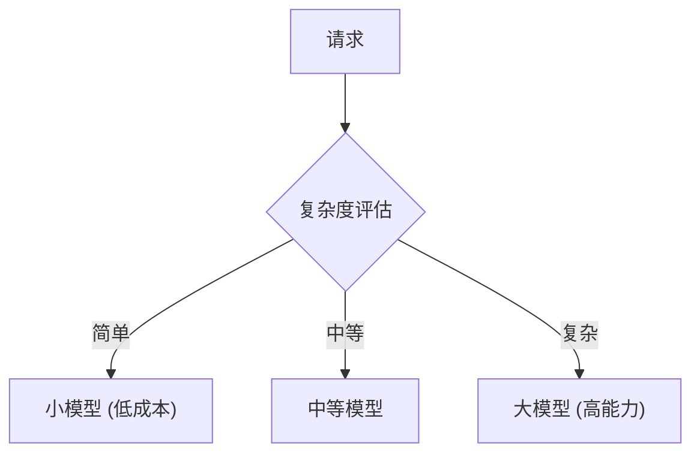

## 12.2 性能优化与成本控制

在生产环境中，性能和成本是两个需要持续优化的关键维度。本节将深入探讨具体的优化策略和实践方法。

### 12.2.1 性能优化

性能优化涉及延迟、吞吐量等多个方面，需要根据业务特点选择合适的策略。

#### 延迟优化

延迟是用户体验的关键指标，特别是在实时交互场景中。

**减少 Token 数量**

Token 数量直接影响响应延迟：
- 压缩上下文：使用 [6.2 节](../06_compress/6.2_summarization.md)介绍的摘要和提取技术
- 精准检索：提高检索精度，减少无关内容
- 移除冗余：删除重复和不必要的内容
- 简化系统提示词：用更简洁的方式表达指令

实践案例（示意）：一些客服系统在优化系统提示词、检索裁剪与输出约束后，往往可以观察到输入 Token 与端到端延迟的明显下降；具体幅度取决于业务请求分布、缓存命中率与模型/部署形态。

**并行处理**

将可并行的操作同时执行：
- 并行检索：同时查询多个知识库
- 并行工具调用：模型返回多个工具调用时并行执行
- 异步处理：非关键路径操作异步执行

```python
async def parallel_retrieve(query, sources):
    tasks = [source.search(query) for source in sources]
    results = await asyncio.gather(*tasks)
    return merge_results(results)
```

**缓存策略**

合理使用缓存可以显著降低延迟：
- 嵌入缓存：缓存文档和查询的嵌入向量
- 检索结果缓存：相同或相似查询复用结果
- 提示词缓存（Prompt Caching）：模型级别的前缀缓存，主流模型均已支持

提示词缓存的使用技巧：
- 将稳定内容（系统提示词、知识库内容）放在前面
- 动态内容（用户输入）放在后面
- 保持前缀一致性以最大化缓存命中

**流式输出**

使用流式 API 改善用户感知：
- 尽早开始生成：用户可以立即看到输出
- 逐步输出结果：边生成边展示
- 改善体感延迟：虽然总时间可能不变，但用户体验更好

```python
async for chunk in model.stream_generate(prompt):
    yield chunk.text
```

#### 吞吐优化

在高并发场景下，吞吐量是关键指标。

**批量处理**

合并请求提高效率：
- 合并相似请求：短时间内的相似请求可以批量处理
- 批量嵌入计算：一次调用处理多个文本
- 批量检索：合并检索请求减少往返次数

**资源管理**

合理管理系统资源：
- 连接池：复用数据库和 API 连接
- 并发控制：限制最大并发数，防止过载
- 负载均衡：多实例部署，分散请求

**队列与削峰**

使用消息队列处理突发流量：
- 请求排队：高峰期请求进入队列
- 优先级处理：重要请求优先处理
- 流量整形：平滑请求峰值

### 12.2.2 成本控制

在大规模部署场景下，成本控制直接影响项目的可持续性。

#### Token 成本

Token 是主要成本来源，需要重点优化：

| 优化方向 | 方法 | 预期效果（示意） |
|----------|------|----------|
| 减少输入 | 压缩、精简提示词、精准检索 | 可显著下降 |
| 减少输出 | 控制输出长度、格式约束 | 可显著下降 |
| 模型选择 | 简单任务用小模型 | 视能力档位而定 |
| 缓存复用 | 利用 prompt 缓存 | 取决于命中率 |

**分层模型策略**

根据任务复杂度选择不同模型：



实现方式：
- 规则分类：基于关键词或模式判断
- 模型分类：用小模型判断复杂度
- 逐级升级：先用小模型尝试，失败后升级

#### 基础设施成本

除了 Token 成本，还需要关注基础设施：
- 向量数据库：选择合适规模，按需扩展
- 计算资源：使用 Serverless 或按需实例
- 存储：冷热分层，不常用数据用低成本存储

### 12.2.3 成本监控

建立完善的成本监控体系：

```python
def track_cost(request, response):
    input_tokens = count_tokens(request)
    output_tokens = count_tokens(response)
    
    cost = (input_tokens * INPUT_PRICE 
            + output_tokens * OUTPUT_PRICE)
    
    log_cost(
        request_id=request.id,
        total_tokens=input_tokens + output_tokens,
        cost=cost,
        model=request.model,
        task_type=request.task_type
    )
    
    # 聚合统计
    update_daily_stats(cost, request.task_type)
```

**成本仪表盘**

建立可视化的成本监控：
- 实时成本：当前小时/日的累计成本
- 趋势分析：成本变化趋势
- 分类统计：按模型、任务类型、用户分组
- 异常告警：成本突增时及时告警

#### 预算控制

设置成本预算和自动保护：

```python
if daily_cost > budget * 0.8:
    alert("接近每日预算上限")
    
if daily_cost > budget:
    throttle_requests()  # 限流
    alert_urgent("已超出预算，启动限流")
```

### 12.2.4 性能与成本的权衡

性能和成本往往需要权衡：

```
高质量 ←→ 低成本
低延迟 ←→ 高吞吐
```

根据业务优先级做出决策：

| 场景 | 优先级 | 策略 |
|------|--------|------|
| 实时对话 | 延迟优先 | 投入更多成本，使用缓存和流式输出 |
| 批量处理 | 吞吐优先 | 批量处理，接受更高延迟 |
| 成本敏感 | 成本优先 | 使用小模型，限制 Token，接受质量损失 |
| 高价值用户 | 质量优先 | 使用最强模型，提供最佳体验 |

### 12.2.5 优化效果度量

建立明确的指标来衡量优化效果：

| 指标类别 | 具体指标 | 目标范围（示意） |
|----------|----------|----------|
| 延迟 | P50/P95/P99 响应时间 | 以产品 SLO 为准 |
| 吞吐 | QPS（每秒请求数） | 根据业务定 |
| 成本 | 每请求成本 | 以基线持续下降为目标 |
| 质量 | 任务成功率 | 以业务验收为准 |

通过持续监控这些指标，可以量化优化效果，指导后续工作方向。
