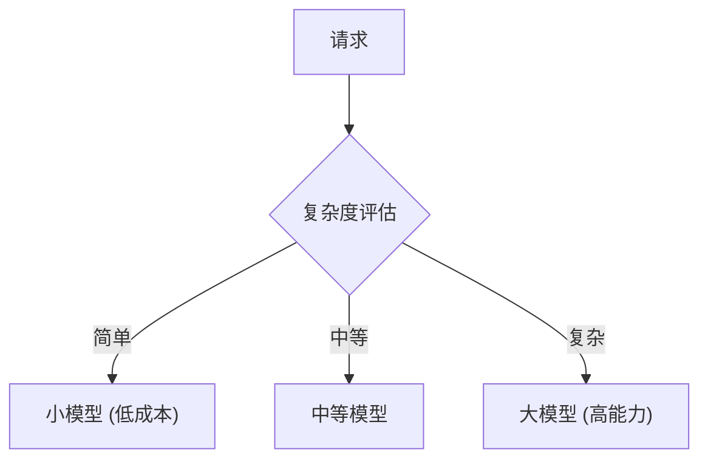

## 12.2 性能优化与成本控制

在生产环境中，性能和成本是两个需要持续优化的关键维度。本节将深入探讨具体的优化策略和实践方法。

### 12.2.1 性能优化

性能优化涉及延迟、吞吐量等多个方面，需要根据业务特点选择合适的策略。

#### 延迟优化

延迟是用户体验的关键指标，特别是在实时交互场景中。

**减少 Token 数量**

Token 数量直接影响响应延迟：
- 压缩上下文：使用 [6.2 节](../06_compress/6.2_summarization.md)介绍的摘要和提取技术
- 精准检索：提高检索精度，减少无关内容
- 移除冗余：删除重复和不必要的内容
- 简化系统提示词：用更简洁的方式表达指令

实践案例（示意）：一些客服系统在优化系统提示词、检索裁剪与输出约束后，往往可以观察到输入 Token 与端到端延迟的明显下降；具体幅度取决于业务请求分布、缓存命中率与模型/部署形态。

**并行处理**

将可并行的操作同时执行：
- 并行检索：同时查询多个知识库
- 并行工具调用：模型返回多个工具调用时并行执行
- 异步处理：非关键路径操作异步执行

```python
async def parallel_retrieve(query, sources):
    tasks = [source.search(query) for source in sources]
    results = await asyncio.gather(*tasks)
    return merge_results(results)
```

**缓存策略**

合理使用缓存可以显著降低延迟：
- 嵌入缓存：缓存文档和查询的嵌入向量
- 检索结果缓存：相同或相似查询复用结果
- 提示词缓存：模型级别的前缀缓存，通过复用计算好的 KV Cache 极大降低延迟和成本。

**提示词缓存控制机制**：
- **主动断点**：开发者可以通过特定参数标记显式指示服务器在此处截取并创建缓存状态（如 Anthropic 协议中的 `ephemeral` 断点）。通过在长文档内容块结尾专门设置断点来提高命中率。
- **自动缓存**：部分服务提供商现已支持自动检测最后可缓存的块并滑动寻找断点，但配合恰当的显式控制能达到更稳固的效果。
- **前缀一致性**：时刻铭记哪怕是一个字节的变化，也会导致后续缓存的雪崩式失效。

#### 前缀缓存的上下文排列策略

前缀缓存从输入序列的起始位置开始匹配，直到遇到第一个不同的 Token 即终止。这一特性意味着上下文的排列顺序直接决定缓存效率。

最佳实践是将**不变的内容放在提示词前部，变化的内容放在末尾**：

- 系统提示词和角色设定（几乎不变）→ 放在最前面
- 工具定义和 Schema（每个会话内不变）→ 紧随其后
- 检索到的文档和上下文（每轮可能更新）→ 中间位置
- 对话历史（每轮追加）→ 接近末尾
- 用户当前输入（每次不同）→ 最末位置

以下示例对比了两种排列方式对缓存命中的影响：

高效排列（缓存命中率高）：

| 位置 | 内容 | 缓存状态 |
|------|------|---------|
| 1 | 系统提示词 | 命中 |
| 2 | 工具定义 | 命中 |
| 3 | 文档上下文 | 命中 |
| 4 | 用户输入 | 未命中 |

低效排列（缓存命中率低）：

| 位置 | 内容 | 缓存状态 |
|------|------|---------|
| 1 | 用户输入 | 未命中 |
| 2 | 系统提示词 | 未命中（前缀已中断） |
| 3 | 工具定义 | 未命中 |
| 4 | 文档上下文 | 未命中 |

对于商业 API，缓存命中的 Token 价格通常远低于未命中的 Token（如 Anthropic 的缓存命中价格仅为常规输入的 10%），因此合理的上下文排列不仅降低延迟，也直接节省成本。

**流式输出**

使用流式 API 改善用户感知：
- 尽早开始生成：用户可以立即看到输出
- 逐步输出结果：边生成边展示
- 改善体感延迟：虽然总时间可能不变，但用户体验更好

```python
async for chunk in model.stream_generate(prompt):
    yield chunk.text
```

#### 推理性能核心指标

在推理层面，以下三个指标对上下文工程的优化决策至关重要：

- **TTFT**（Time to First Token，首 Token 延迟）：从请求发出到收到第一个输出 Token 的时间。本质上是“处理提示词的时间”，直接反映系统的响应速度。前缀缓存通过跳过已缓存 Token 的 Prefill 计算，可以显著降低 TTFT
- **TPS**（Tokens Per Second，每秒 Token 数）：模型的“打字速度”，衡量生成阶段的吞吐
- **ITL**（Inter-Token Latency，Token 间延迟）：生成连续两个 Token 之间的时间间隔，决定流式输出的流畅度

上下文工程师可以通过以下方式影响这些指标：缩短输入长度降低 TTFT，优化前缀结构提高缓存命中率降低 TTFT，以及通过压缩上下文减少 KV 缓存内存占用从而间接提升 TPS。

#### 吞吐优化

在高并发场景下，吞吐量是关键指标。

**批量处理**

合并请求提高效率：
- 合并相似请求：短时间内的相似请求可以批量处理
- 批量嵌入计算：一次调用处理多个文本
- 批量检索：合并检索请求减少往返次数

**资源管理**

合理管理系统资源：
- 连接池：复用数据库和 API 连接
- 并发控制：限制最大并发数，防止过载
- 负载均衡：多实例部署，分散请求

**队列与削峰**

使用消息队列处理突发流量：
- 请求排队：高峰期请求进入队列
- 优先级处理：重要请求优先处理
- 流量整形：平滑请求峰值

### 12.2.2 成本控制

在大规模部署场景下，成本控制直接影响项目的可持续性。

#### Token 成本

Token 是主要成本来源，需要重点优化：

| 优化方向 | 方法 | 预期效果（示意） |
|----------|------|----------|
| 减少输入 | 压缩、精简提示词、精准检索 | 可显著下降 |
| 减少输出 | 控制输出长度、格式约束 | 可显著下降 |
| 模型选择 | 简单任务用小模型 | 视能力档位而定 |
| 缓存复用 | 利用 prompt 缓存 | 取决于命中率 |

**分层模型策略**

根据任务复杂度选择不同模型：


```mermaid
graph TB
    A["请求"] --> B{"复杂度评估"}
    B --> |"简单"| C["小模型 (低成本)"]
    B --> |"中等"| D["中等模型"]
    B --> |"复杂"| E["大模型 (高能力)"]
```

图 12-3：分层模型路由策略

实现方式：
- 规则分类：基于关键词或模式判断
- 模型分类：用小模型判断复杂度
- 逐级升级：先用小模型尝试，失败后升级

**模型隔离与缓存穿透陷阱**：
由于生成式的提示词缓存是严格与特定模型架构与权重绑定的，在中途中进行随意的模型降级往往会落入“捡了芝麻丢了西瓜”的陷阱。假如在一次刚刚积累了十几万 Token 的对话会话中，仅仅为了处理一个极其简单的逻辑就将其临时抛给廉价的小模型来处理，那么该小模型将不得不从零开始重新读取和计算那庞大的前缀（引发一次全量定额的写入开销与首包延迟）。此时，继续留在本来较贵的、但是预热完备的大型模型上下文中依靠低折扣缓存复用运作，往往会更便宜也更为迅速。如果实有必要动用轻便的小模型，则应当考虑衍生出一个不需要承担所有环境包袱的”全新且隔离的内容子智能体”。

#### 基础设施成本

除了 Token 成本，还需要关注基础设施：
- 向量数据库：选择合适规模，按需扩展
- 计算资源：使用 Serverless 或按需实例
- 存储：冷热分层，不常用数据用低成本存储

### 12.2.3 成本监控

建立完善的成本监控体系：

```python
def track_cost(request, response):
    input_tokens = count_tokens(request)
    output_tokens = count_tokens(response)

    cost = (input_tokens * INPUT_PRICE
            + output_tokens * OUTPUT_PRICE)

    log_cost(
        request_id=request.id,
        total_tokens=input_tokens + output_tokens,
        cost=cost,
        model=request.model,
        task_type=request.task_type
    )

    # 聚合统计
    update_daily_stats(cost, request.task_type)
```

**成本仪表盘**

建立可视化的成本监控：
- 实时成本：当前小时/日的累计成本
- 趋势分析：成本变化趋势
- 分类统计：按模型、任务类型、用户分组
- 异常告警：成本突增时及时告警

#### 预算控制

设置成本预算和自动保护：

```python
if daily_cost > budget * 0.8:
    alert("接近每日预算上限")

if daily_cost > budget:
    throttle_requests()  # 限流
    alert_urgent("已超出预算，启动限流")
```

### 12.2.4 性能与成本的权衡

性能和成本往往需要权衡：

```text
高质量 ←→ 低成本
低延迟 ←→ 高吞吐
```

根据业务优先级做出决策：

| 场景 | 优先级 | 策略 |
|------|--------|------|
| 实时对话 | 延迟优先 | 投入更多成本，使用缓存和流式输出 |
| 批量处理 | 吞吐优先 | 批量处理，接受更高延迟 |
| 成本敏感 | 成本优先 | 使用小模型，限制 Token，接受质量损失 |
| 高价值用户 | 质量优先 | 使用最强模型，提供最佳体验 |

### 12.2.5 优化效果度量

建立明确的指标来衡量优化效果：

| 指标类别 | 具体指标 | 目标范围（示意） |
|----------|----------|----------|
| 延迟 | P50/P95/P99 响应时间 | 以产品 SLO 为准 |
| 吞吐 | QPS（每秒请求数） | 根据业务定 |
| 成本 | 每请求成本 | 以基线持续下降为目标 |
| 质量 | 任务成功率 | 以业务验收为准 |

通过持续监控这些指标，可以量化优化效果，指导后续工作方向。

### 12.2.6 案例研究：Claude Code 的生产级上下文优化

Claude Code 的查询引擎是在大规模生产环境中实践上下文工程的典范。其核心设计采用了精心编排的多步骤处理管道，以及多重防护机制，确保在高负载下仍保持稳定和高效。

#### 查询引擎的 10 步处理管道

Claude Code 的查询引擎在每一轮用户交互中执行以下 10 个步骤，形成一个严密的处理流程：

1. **记忆预取（Memory Prefetch）**：在处理用户请求前，系统后台异步加载与会话相关的持久化记忆，利用预取隐藏网络延迟。

2. **技能发现（Skill Discovery）**：扫描用户工作目录和配置中可用的技能/工具，动态构建工具集合。这一步避免了在每次请求时重复扫描目录。

3. **工具结果预算分配（Tool Result Budget）**：根据当前令牌使用情况和模型窗口大小，计算本轮工具调用能容纳的最大结果规模。超出预算的工具调用直接返回摘要而非完整结果。

4. **历史裁剪（History Trimming）**：基于重要性、相关性和时间衰减，删除不必要的历史消息。这一步在自动压缩之前进行，以快速释放空间。

5. **微观压缩（Micro-compaction）**：对本轮新产生的上下文进行轻量级压缩（如删除冗余空白、合并相邻的同类消息），成本极低但效果明显。

6. **上下文折叠投影（Context Fold Projection）**：在实际调用 API 前，构建一个投影模型来预测最终的上下文大小。这允许系统提前判断是否需要更激进的压缩。

7. **自动压缩（Auto-compaction）**：如果预测大小超过自动压缩阈值（effective_window - 13,000 tokens），使用 LLM 对历史消息进行摘要压缩。每次压缩调用都会产生成本，因此需要精确判断何时触发。

8. **API 调用（API Call）**：向 Anthropic Claude API 发送请求。此时上下文已经过多层优化，规模相对较小。

9. **工具执行（Tool Execution）**：根据模型返回的工具调用并行执行各个工具，并收集结果。结果大小受第 3 步预算的限制。

10. **停止钩子（Stop Hook）**：在智能体停止前执行清理和记录，如保存关键状态到持久化存储，记录性能指标等。

这 10 步形成了一个闭环，使得系统既能响应用户需求，又能持续优化自身的上下文使用。

#### 重试策略与速率限制处理

Claude Code 实现了一套分层的重试策略来应对 API 故障和速率限制：

**基础重试参数**：
- 初始退避延迟：500 毫秒
- 指数退避系数：2（每次重试延迟加倍）
- 随机抖动：25% 的随机变化，防止羊群效应
- 最大延迟：32 秒
- 最大重试次数：10 次

**特殊处理 - HTTP 429（速率限制）**：
- 读取 HTTP 响应头中的 `anthropic-ratelimit-unified-reset` 字段
- 使用该字段指定的时间进行退避，而非盲目的指数退避
- 确保重试时间点精确对应速率限制的重置时间

**特殊处理 - HTTP 529（服务降级）**：
- 允许最多 3 次连续 529 错误的重试
- 若连续失败 3 次，自动降级至备用模型（如 Claude Haiku）
- 背景请求（低优先级）在遇到 529 时立即中止，不消耗重试次数
- 这样设计是因为 529 通常表示服务方在流量限流，继续重试只会加剧问题

#### 自动压缩的断路器机制

自动压缩虽然有效，但成本较高。每次压缩失败都会再次发送完整上下文进行 API 调用，约消耗 250K 令牌的成本。Claude Code 实现了一个防护机制：

- **阈值**：连续压缩失败 3 次
- **触发条件**：失败可能表明上下文中存在大型的不可压缩工具结果（如大数据表格、二进制数据）
- **响应**：进入断路器开启状态，停止重试压缩，转而采用更激进的删除策略（删除较早的工具结果，保留最新的关键信息）
- **恢复**：经过一段时间或用户明确指示后，重置计数器，重新尝试压缩

这一机制在理论上很简单，但在防止成本意外飙升方面效果显著。

#### 会话压缩服务（Session Compression Service）

对于长期运行的会话（如用户与 Claude Code 进行多小时的编码会话），系统实现了基于令牌阈值的自动压缩服务：

- **监控点**：持续跟踪会话的令牌消费
- **压缩触发**：当令牌消费达到预定义阈值（如累计 50 万令牌）时，对整个会话的对话历史进行一次全局压缩
- **保留策略**：压缩时保留以下信息：
  - 系统提示词（完整保留）
  - 最近 N 条消息（完整保留）
  - 早期消息（摘要处理）
  - 用户反馈和纠正（完整保留，这些往往包含重要的约束）
- **压缩结果形式**：生成一份”会话检查点”，包含对话走向、关键决策和进度信息

该服务在后台运行，不阻塞用户交互。

#### 推测执行引擎（Speculation Engine）

为了最大化 API 响应等待时间的利用，Claude Code 实现了一个推测执行引擎：

- **工作原理**：在等待 API 响应的同时，系统根据已发送的提示词预测可能的工具调用，并提前执行这些工具
- **隔离机制**：所有推测执行的文件写操作被重定向到一个覆盖文件系统（overlay filesystem）中，不影响真实文件系统
- **命令限制**：禁止执行 bash 命令（这些是不可逆操作），只允许文件 I/O 和工具调用
- **结果处理**：
  - 若推测正确（API 返回了预测的工具调用），直接使用预先计算的结果，无需重新执行
  - 若推测错误，丢弃覆盖文件系统中的改动，继续执行 API 实际返回的工具调用
- **ROI 跟踪**：系统记录推测执行节省的时间，用于评估该功能的有效性并持续优化

这一设计将”等待”时间转化为有生产力的工作，特别是在网络延迟较高或 API 响应较慢的场景下能显著改善整体延迟。

通过这些多维度、多层次的优化策略，Claude Code 在生产环境中实现了高效的上下文管理，既保证了可靠性和用户体验，又有效控制了成本。这些设计原则和实现技巧对其他大规模智能体系统的开发具有重要参考价值。
