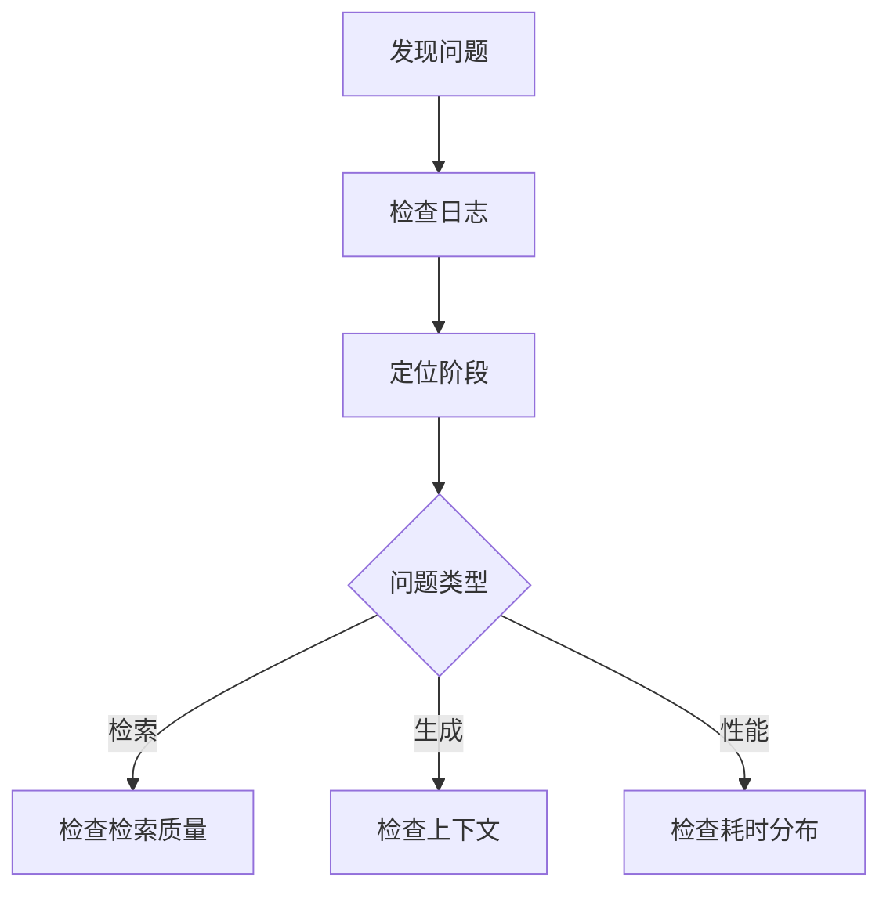

## 12.3 可观测性与调试

### 12.3.1 可观测性的三大支柱与上下文平面

**日志（Logs）**
记录系统运行的详细事件

**指标（Metrics）**
量化的系统状态数据

**追踪（Traces）**
请求在系统中的完整路径

在智能体工程中，这三大支柱需要与 **上下文平面（Context-Plane）** 紧密结合。上下文平面是 Agent Harness 的五个核心平面之一，负责管理：
- **会话状态**（Session State）：智能体执行的阶段和进度
- **记忆管理**（Memory）：长期和短期的信息存储
- **上下文压缩**（Compaction/Summarization）：历史信息的精简与整理
- **工件日志**（Artifact Logs）：可重放的执行记录与检查点

这四个维度共同构成了上下文管理的核心，使得“推理”能够被转化为可追踪、可审计的有类型的行动记录（Typed Actions as Replayable Artifacts）。

### 12.3.2 上下文相关的关键指标

| 指标 | 说明 | 告警阈值（示意） |
|------|------|----------|
| 上下文 Token 数 | 每次请求的上下文大小 | 接近窗口上限 |
| 检索延迟 | 检索操作耗时 | 以 SLO 与基线为准 |
| 检索命中率 | 检索到相关结果的比例 | 以基线与业务验收为准 |
| 压缩率 | 压缩后/压缩前 | 异常波动 |
| 成本/请求 | 单次请求的成本 | 超出预算 |

### 12.3.3 日志设计

#### 结构化日志

```json
{
  "timestamp": "2024-03-01T10:00:00Z",
  "request_id": "req_123",
  "stage": "context_build",
  "input_tokens": 500,
  "retrieved_chunks": 5,
  "context_tokens": 2000,
  "duration_ms": 150
}
```

#### 日志级别

- **ERROR**：失败的操作
- **WARN**：接近限制、降级处理
- **INFO**：关键流程节点
- **DEBUG**：详细调试信息

### 12.3.4 请求追踪与分布式跟踪标准

完整追踪请求处理流程：

```text
request_123
├── 接收请求 [0ms]
├── 查询处理 [10ms]
├── 知识检索 [120ms]
│   ├── 嵌入计算 [30ms]
│   └── 向量搜索 [90ms]
├── 重排序 [50ms]
├── 上下文构建 [20ms]
├── 模型调用 [800ms]
└── 响应返回 [1000ms]
```

#### OpenTelemetry 与 W3C Trace Context

为了在分布式智能体系统中进行跨越多个工具边界的追踪，推荐使用 **OpenTelemetry** 标准与 **W3C Trace Context** 规范：

**OpenTelemetry 的核心要素**：
- **Spans**：表示某个操作的时间段和上下文信息，包括开始时间、结束时间、属性、事件和链接
- **Traces**：由多个相关的 Span 组成的完整执行链路，通过唯一的 Trace ID 关联
- **Context Propagation**：跨进程、跨服务传播 Trace ID 和 Span ID，使得分布式调用能被串联起来

**W3C Trace Context** 通过标准化的 HTTP 头（`traceparent` 和 `tracestate`）在服务间传播追踪信息，确保不同的工具和系统能够互操作。

#### AI 特定语义约定（OpenInference）

OpenTelemetry 的通用约定需要针对 AI 系统进行扩展。**OpenInference** 项目定义了 AI 特定的语义约定：

- **检索 Spans**：记录向量检索、关键词检索等操作，包括查询、检索文档数、相关性得分
- **工具调用 Spans**：记录每次工具调用的输入参数、执行时间、返回结果
- **提示词与完成度 Spans**：记录发送给模型的完整提示词、模型的完整响应，以便调试和优化
- **Token 使用情况**：在 Span 属性中记录输入和输出的 Token 数，便于成本分析

这些语义约定使得观测数据能够被更深入地分析，例如：
- 计算单个请求的总 Token 成本
- 识别哪个检索步骤耗时最长或质量最差
- 关联工具调用失败与模型提示的关系

#### 工件日志与可重放性

为了支持完整的可审计性和调试，所有重要的中间结果应该以 **工件（Artifacts）** 的形式持久化：

- **结构化格式**：使用 JSON 或 Protocol Buffers 等机器可读的格式，而不仅仅是文本日志
- **校验和与版本**：记录工件的内容哈希值和版本号，确保可重放时的一致性
- **上下文快照**：在关键决策点保存完整的上下文快照，包括状态、提示词、工具输入输出等

这些工件可以被用于：
1. **离线调试**：从日志中重现问题场景
2. **AB测试**：使用相同的工件重新运行不同版本的模型或算法，对比结果
3. **合规审计**：证明决策过程的每一步都是可追踪和可验证的

### 12.3.5 上下文快照

保存关键请求的完整上下文：

```python
if should_snapshot(request):
    save_snapshot({
        "request_id": request.id,
        "full_context": context,
        "retrieved_docs": docs,
        "model_response": response,
        "metadata": {...}
    })
```

用于：调试问题、效果分析、回放测试

### 12.3.6 调试技巧

#### 问题定位流程


```mermaid
graph TB
    A["发现问题"] --> B["检查日志"]
    B --> C["定位阶段"]
    C --> D{"问题类型"}
    D --> |"检索"| E["检查检索质量"]
    D --> |"生成"| F["检查上下文"]
    D --> |"性能"| G["检查耗时分布"]
```

图 12-4：问题定位流程

#### 常见问题诊断

| 症状 | 可能原因 | 检查点 |
|------|----------|--------|
| 答案不相关 | 检索问题 | 检索结果、嵌入质量 |
| 答案不完整 | 上下文不足 | 上下文内容、压缩程度 |
| 幻觉 | 缺乏依据 | 是否有相关知识 |
| 响应慢 | 瓶颈 | 各阶段耗时 |

### 12.3.7 监控仪表盘

建立可视化监控：
- 实时请求量和延迟
- Token 使用分布
- 错误率趋势
- 成本累计

### 12.3.8 告警设置

配置关键告警：
- 错误率超过阈值
- 延迟异常升高
- 成本超出预算
- Token 接近上限

### 12.3.9 常用可观测性工具（示例）

以下列举若干在业界较常见的工具/产品方向（以各工具最新能力与版本为准）：

**LangSmith (LangChain)**
- **特点**：全链路追踪，Prompt 编排，数据集评估。与 LangChain 生态集成度高。
- **适用**：LangChain 用户，需要完整 DevOps 流程的团队。

**LangFuse**
- **特点**：开源，支持自托管，详细的 Trace 和 Score 功能。
- **适用**：注重数据隐私，需要开源解决方案的团队。

**Arize Phoenix**
- **特点**：专注于 LLM Tracing 和 Evaluation，提供 Notebook 环境下的可视化。
- **适用**：数据科学家，需要深入分析 Trace 的场景。

**Weights & Biases (W&B)**
- **特点**：传统的 ML 实验追踪工具，增加了 Prompts 和 LLM 监控功能。
- **适用**：已有 W&B 工作流的 ML 团队。
