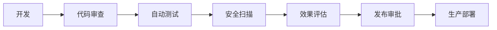
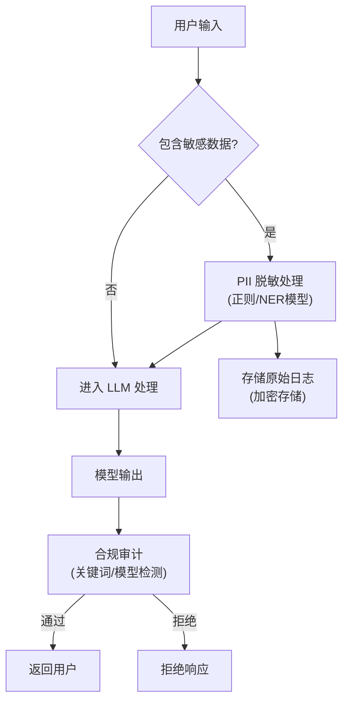

## 12.4 安全性与治理

### 12.4.1 安全风险类型

| 风险类型 | 说明 | 影响 |
|----------|------|------|
| 提示词注入 | 恶意输入覆盖指令 | 系统被操纵 |
| 信息泄露 | 敏感信息被暴露 | 隐私/商业风险 |
| 数据污染 | 恶意内容进入知识库 | 输出质量下降 |
| 滥用攻击 | 大量请求消耗资源 | 成本/可用性 |

### 12.4.2 提示词注入防护

#### 输入验证

```python
def validate_input(user_input):
    # 检测可疑模式
    if contains_injection_patterns(user_input):
        raise SecurityException("疑似注入攻击")
    
    # 长度限制
    if len(user_input) > MAX_INPUT_LENGTH:
        raise ValidationError("输入过长")
```

#### 结构隔离

使用标签明确分隔：
```xml
<system_instructions>
[核心指令 - 不可覆盖]
</system_instructions>

<user_input>
[用户输入 - 可能包含恶意内容]
</user_input>
```

#### 输出过滤

检查输出是否包含敏感信息：
```python
def filter_output(response):
    if contains_sensitive(response):
        return sanitize(response)
    return response
```

### 12.4.3 信息安全

#### 敏感信息保护

- 系统提示词不应泄露
- 用户数据需加密
- 日志脱敏

#### 访问控制

```python
def check_access(user, resource):
    if not user.has_permission(resource):
        raise AccessDenied()
```

#### 数据分级

| 级别 | 内容 | 处理方式 |
|------|------|----------|
| 公开 | 通用知识 | 正常处理 |
| 内部 | 业务数据 | 访问控制 |
| 机密 | 敏感信息 | 加密+审计 |
| 绝密 | 核心秘密 | 禁止进入上下文 |

### 12.4.4 治理框架

#### 上下文资产管理

- 提示词版本控制
- 知识库来源追踪
- 配置变更审批

#### 质量门禁



图 12-5：治理质量门禁

#### 审计追踪

记录关键操作：
- 配置变更
- 敏感数据访问
- 异常行为

#### 记忆增强架构下的专项治理 （Memory Governance）

随着 AI 应用从无状态（上下文）转向有状态（记忆系统），记忆资产的治理必须一开始就被提到最高优先级：
- **受控隔离 (Anti-crosstalk)**：严格的用户权限与图谱隔离机制，确保“张三的记忆绝不能串给李四”，保护隐私边界。
- **动态更新一致性 (Update Consistency)**：当事实或偏好发生活跃变更（如从“住在北京”变为“搬到了上海”），系统必须能够精准定位到旧有记忆节点进行平滑覆盖或清洗，保留完整版本历史的同时对外保持唯一真值。
- **记忆幻觉防火墙 (Hallucination Firewall)**：通用大模型在抽取记忆时极易发生幻觉（如捏造细节）。必须对写入长期记忆库的情报执行专门的幻觉校验与一致性评估。

### 12.4.5 合规考虑与本地化

#### 数据合规流程

在处理敏感数据（如 PII、医疗数据）时，必须遵循标准化的审计流程：



图 12-6：数据合规流程

#### 本地化合规实践（中国市场）

针对中国市场的企业与政府项目，需特别关注**信创（信息技术应用创新）**体系与相关法规：

1.  **基础设施适配**：
    *   **算力**：适配国产 AI 芯片（如华为昇腾、海光）。
    *   **操作系统**：兼容国产 OS（如麒麟、统信）。
    *   **数据库**：支持国产向量数据库（如腾讯云 VectorDB、阿里云 DashVector）。
2.  **内容安全标准**：
    *   遵循《生成式人工智能服务管理暂行办法》。
    *   集成官方指定的敏感词库进行双重过滤。
    *   并在系统提示词中明确“核心价值观”对齐要求。
3.  **数据出境**：
    *   严禁将境内关键数据传输至境外 API。
    *   对于通过 API 调用的境外模型，需部署本地“数据网关”进行请求过滤（DLP）。
4.  **备案要求**：
    *   算法备案：提供算法机制、训练数据来源等说明。
    *   安全评估：上线前需通过网信办的安全评估。

### 12.4.6 应急响应

准备应急预案：
1. **发现问题**：监控告警
2. **快速止损**：降级或回滚
3. **分析原因**：深入调查
4. **彻底修复**：根本解决
5. **总结复盘**：防止再发
