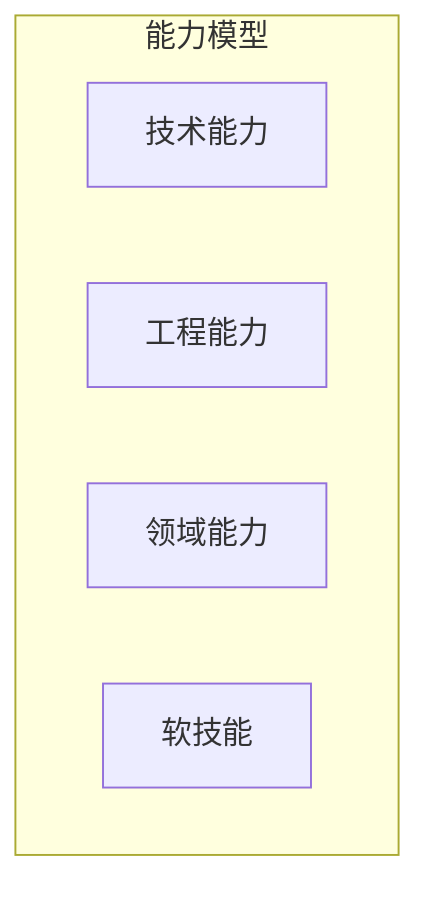

## 15.4 成为上下文工程专家

### 15.4.1 能力模型

上下文工程专家需要多维能力：

**技术能力**
- 深入理解 LLM 原理
- 熟悉 [RAG](../05_select/5.1_rag_principles.md) 技术栈
- 掌握向量数据库
- 了解评估方法

**工程能力**
- 系统设计能力
- 代码实现能力
- 调试和优化能力
- 生产运维能力

**领域能力**
- 业务领域理解
- 用户需求洞察
- 知识管理能力

**软技能**
- 沟通协作
- 问题分析
- 持续学习

### 15.4.2 学习路径

#### 第一阶段：基础建立

1. 理解大模型基础原理
2. 学习提示词工程基础
3. 掌握 RAG 基本流程
4. 动手实现简单项目

#### 第二阶段：技术深化

1. 深入各策略的高级技术
2. 学习智能体开发
3. 掌握评估和优化方法
4. 参与复杂项目

#### 第三阶段：专业精通

1. 系统设计和架构能力
2. 前沿技术跟踪
3. 形成方法论
4. 输出和分享

### 15.4.3 实践建议

**持续实践**

理论必须结合实践：
- 参与实际项目
- 构建个人项目
- 分析和复现案例

**关注前沿**

保持学习：
- 关注学术论文
- 追踪业界动态
- 参与社区讨论

**总结输出**

通过输出加深理解：
- 编写技术博客
- 开源实践项目
- 分享经验教训

**建立网络**

与同行交流：
- 参与社区活动
- 建立专业人脉
- 寻找导师

### 15.4.4 资源推荐

**官方文档**
- OpenAI 文档
- Anthropic 文档（Claude）
- LangChain/LlamaIndex 文档

**学习平台**
- Coursera/DeepLearning.AI 课程
- 官方教程和指南

**社区资源**
- GitHub 开源项目
- Discord/Slack 社区
- 技术博客

### 15.4.5 结语

上下文工程是 AI 时代的核心能力之一。掌握这门技术，将使你能够构建更智能、更可靠的 AI 应用，在快速发展的行业中占据有利位置。

希望本书能够成为你学习上下文工程的起点，祝你在这一领域取得成功！
