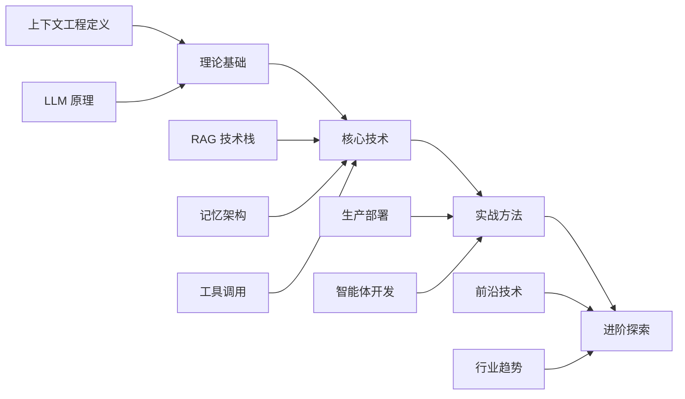

<div align="center">

# 大模型上下文工程权威指南

**从理论到实践，掌握 AI 时代最核心的工程能力**

[](https://creativecommons.org/licenses/by-nc-sa/4.0/)
[](https://github.com/yeasy/context_engineering_guide)

[](https://yeasy.gitbook.io/context-engineering-guide)

[开始阅读](#快速开始) · [核心内容](#核心内容) · [适合谁读](#目标读者) · [参与贡献](#参与贡献)


</div>
---

## 为什么需要这本书？

> “提示词工程已死，上下文工程永生。”  
> — 2026

当 LLM 应用从实验走向生产，**单纯的提示词设计已不足以构建可靠的 AI 系统**。

上下文工程解决的核心问题是：

```text
如何在正确的时间，将正确的信息，以正确的格式，提供给模型？
```

这本书将带你系统掌握这门 AI 时代最核心的工程能力。

> 💡 **本书与提示词工程的关系**：[《大模型提示词工程指南》](https://github.com/yeasy/prompt_engineering_guide) 聚焦于单次交互中的提示词设计技巧；而本书则关注更宏观的系统层面——如何通过 RAG、记忆架构、工具调用和上下文压缩等工程手段，在生产环境中持续为模型提供高质量的上下文。建议先阅读提示词工程作为基础，再深入本书的上下文工程体系。

---

## 核心内容

<table>
<tr>
<td width="50%">

### 第一部分：认识上下文工程

- 上下文工程的定义与价值
- 从提示词工程到上下文工程的演进
- LLM 基础：上下文窗口与 Token
- 理论框架：四大原则与核心策略

</td>
<td width="50%">

### 第二部分：核心技术与策略

- **Write** — 外部存储与记忆架构
- **Select** — RAG 与检索增强生成
- **Compress** — 摘要与上下文压缩
- **Isolate** — 结构化与隔离设计

</td>
</tr>
<tr>
<td width="50%">

### 第三部分：进阶技术与架构

- 工具调用与能力扩展
- 智能体上下文管理
- 自主检索增强生成 (Agentic RAG)
- 长上下文模型应用
- 多模态上下文管理
- 上下文工程反模式

</td>
<td width="50%">

### 第四部分：工程实战与未来演进

- 生产环境的最佳实践
- 真实系统架构案例分析
- 项目实战体验
- 基础设施与未来前瞻
- 附录 A：术语表
- 附录 B：工具与技术生态
- 附录 C：参考资源
- 附录 D：参考文献

</td>
</tr>
</table>

---

## 你将学到什么



| 主题 | 你将掌握的能力 |
|------|--------------|
| **RAG 系统** | 分块策略、嵌入模型选择、重排序优化、混合检索 |
| **记忆架构** | 工作记忆 / 短期记忆 / 长期记忆的设计与实现 |
| **工具调用** | Function Calling、MCP 协议、工具设计原则 |
| **智能体** | 单/多智能体上下文管理、状态追踪、记忆学习 |
| **生产实践** | 性能优化、成本控制、可观测性、安全治理 |

---

## 目标读者

本书适合以下读者：

| 角色 | 阅读重点 |
|------|---------|
| 🧑‍💻 **AI 应用开发者** | 核心技术 + 实践方法 |
| ✍️ **提示词工程师** | 理论基础 + 进阶探索 |
| 📊 **AI 产品经理** | 第一部分 + 第三部分概览 |
| 🏗️ **AI 架构师** | 全书精读，重点关注生产实践 |
| 🔬 **研究人员** | 进阶技术 + 未来展望 |

> 💡 **前置知识**：建议具备基础编程能力和对 LLM 的基本了解。

---

## 快速开始

### 在线阅读

👉 **推荐**：[GitBook 在线版](https://yeasy.gitbook.io/context_engineering_guide/)

### 本地阅读

使用 [HonKit](https://github.com/honkit/honkit) 构建本地阅读环境：

```bash
npm install        # 安装依赖
npx honkit serve   # 启动本地服务
```

启动后访问 http://localhost:4000 即可阅读。

### 阅读建议

```text
📕 初学者：按顺序阅读全书
📗 有经验者：重点阅读第二、三部分
📘 快速参考：阅读每章末尾的"本章小结"
```

---

## 目录概览

```text
第一部分：认识上下文工程
├── 第1章：上下文工程概述
├── 第2章：大语言模型基础
└── 第3章：上下文工程框架

第二部分：核心技术
├── 第4章：写入策略 — 外部存储与记忆
├── 第5章：选择策略 — 检索增强生成
├── 第6章：压缩策略 — 上下文优化
└── 第7章：隔离策略 — 结构化设计

第三部分：实践方法
├── 第8章：工具调用与能力扩展
├── 第9章：智能体上下文管理
├── 第10章：进阶技术与架构
└── 第11章：反模式与常见错误

第四部分：工程实战与未来演进
├── 第12章：生产环境最佳实践
├── 第13章：行业应用案例
├── 第14章：综合实战 - 构建企业知识库问答系统
└── 第15章：未来展望与发展趋势

附录
├── 附录A：术语表
├── 附录B：工具与技术生态
├── 附录C：参考资源
└── 附录D：参考文献
```

📖 完整目录请查看 [SUMMARY.md](SUMMARY.md)

---

## 本书特色

| 特色 | 说明 |
|------|------|
| 📐 **体系完整** | 15 章内容，从入门到精通的完整学习路径 |
| 🔬 **理论与实践并重** | 原理剖析 + 代码示例 + 最佳实践 |
| 🆕 **紧跟前沿** | 涵盖 2026 年最新技术进展（Agentic RAG、Graph RAG、MCP 等） |
| 📊 **图文并茂** | Mermaid 流程图 + 表格对比 + 结构化示例 |

---

## 推荐阅读

本书是 AI 技术丛书的一部分。以下书籍与本书形成互补：

| 书名 | 与本书的关系 |
|------|------------|
| [《零基础学 AI》](https://github.com/yeasy/ai_beginner_guide) | AI 零基础入门，适合缺乏 AI 背景的读者 |
| [《大模型提示词工程指南》](https://github.com/yeasy/prompt_engineering_guide) | 提示词设计基础，本书的前置读物 |
| [《Claude 技术指南》](https://github.com/yeasy/claude_guide) | Claude 的 MCP 协议与工具使用实践 |
| [《智能体 AI 权威指南》](https://github.com/yeasy/agentic_ai_guide) | 智能体的上下文管理是本书技术的核心应用场景 |
| [《大模型安全权威指南》](https://github.com/yeasy/ai_security_guide) | 上下文安全（提示注入防御、RAG 安全）的深度参考 |
| [《OpenClaw 从入门到精通》](https://github.com/yeasy/openclaw_guide) | 开源智能体框架中上下文工程的实战应用 |

---

## 参与贡献

欢迎贡献！您可以通过以下方式参与：

- 🐛 [提交 Issue](https://github.com/yeasy/context_engineering_guide/issues) — 报告错误或提出建议
- 📝 [提交 PR](https://github.com/yeasy/context_engineering_guide/pulls) — 改进内容或修复 typo
- ⭐ Star 本项目 — 帮助更多人发现这本书

---

## 许可证

本书采用 [CC BY-NC-SA 4.0](https://creativecommons.org/licenses/by-nc-sa/4.0/) 许可证。

您可以自由分享和演绎，但需署名、非商业使用、相同方式共享。

---

## 项目规则

为了保持书稿的专业性和一致性，本项目遵循以下规则：

1. **术语表规范**：本书必须在附录中包含“术语表”（Glossary），用于标注书中出现的关键术语及其解释。
   - 位置：`appendix/glossary.md`
   - 格式：需按字母顺序或拼音顺序排列，包含中英文对照及简明定义。

---

## 致谢

感谢所有为大模型技术发展做出贡献的研究者与工程师，特别是：

- [Anthropic](https://www.anthropic.com/) — 上下文工程领域的开创性工作与 MCP 协议
- [OpenAI](https://openai.com/)、[Google](https://ai.google/)、[Meta](https://ai.meta.com/) — LLM 技术的持续创新
- [LangChain](https://langchain.com/)、[LlamaIndex](https://llamaindex.ai/) — RAG 框架的宝贵贡献
- 所有开源社区的贡献者们

---

<div align="center">

**📧 联系作者**

如有问题或建议，欢迎通过 [Issue](https://github.com/yeasy/context_engineering_guide/issues) 联系。

---

*让我们一起探索上下文工程的世界，构建更智能、更可靠的 AI 应用。*

**🌟 如果这本书对你有帮助，请给个 Star 支持！**

</div>
